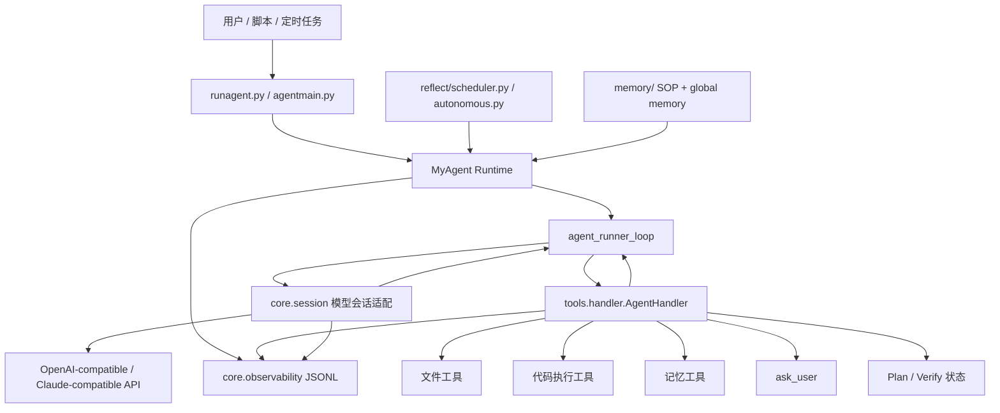
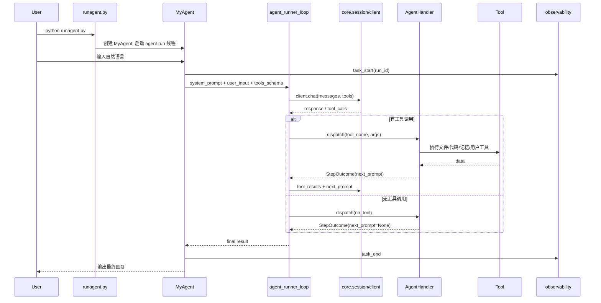
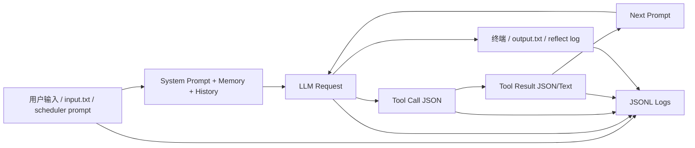

# LocalPilot 项目架构蓝图

生成时间：2026-05-29  
分析范围：当前仓库实现，不包含未落地的产品设想。  
技术栈识别：Python 本地 CLI Agent Runtime。  
架构模式识别：本地单体 Runtime + 分层模块 + Agent Tool-Calling 控制循环 + 文件态任务编排。

## 1. 总体架构

LocalPilot 是一个运行在个人电脑和本地工作区里的通用 Agent Runtime。它不是 Web 服务，也不是云端多租户平台；当前架构的核心目标是把“用户自然语言输入、模型会话、工具调用、文件读写、代码执行、任务计划、长期记忆、定时触发、结构化日志”串成一个可在本机闭环执行的命令行系统。

一句话描述：

> LocalPilot 是一个本地通用 Agent Runtime，通过 Plan-and-Execute + Tool-Calling 循环，把自然语言任务转化为本地文件、代码、记忆和定时任务上的可执行操作。

当前实现可以拆成 6 个主要子系统：



### 架构原则

- **本地优先**：所有任务状态、模型日志、记忆、调度结果和执行输出都落在本地文件系统。
- **模型与工具解耦**：模型层只负责生成文本或工具调用；工具层通过 `AgentHandler` 执行真实副作用。
- **控制流显式化**：工具统一返回 `StepOutcome(data, next_prompt, should_exit)`，由 Agent Loop 决定继续、退出或要求模型修正。
- **多入口单内核**：交互模式、`--task` 文件 I/O 模式、`--reflect` 定时模式最终都进入同一个 `MyAgent.put_task()` 和 `agent_runner_loop()`。
- **可观测性内建**：任务、LLM turn、tool call、异常、retry、usage 都写入 JSONL 事件日志，并用 `run_id` 串联。
- **SOP 驱动复杂任务**：复杂任务不是硬编码流程，而是通过 `memory/plan_sop.md`、`memory/verify_sop.md`、`memory/subagent.md` 约束模型行为。

## 2. 目录结构

```text
LocalPilot/
├── runagent.py                  # 根目录启动入口，转到 agent.agentmain
├── agent/
│   ├── agentmain.py             # CLI 参数、MyAgent、交互/task/reflect 主入口
│   └── agent_loop.py            # 多轮 LLM + tool call 执行循环
├── core/
│   ├── config.py                # mykey.py / mykey.json 配置加载与热更新
│   ├── client.py                # ToolClient / NativeToolClient 适配层
│   ├── session.py               # OpenAI/Claude/mixin session 与流式解析
│   ├── context.py               # 上下文裁剪、tool_result 修复、消息合法化
│   ├── mylogging.py             # 模型原文日志
│   └── observability.py         # JSONL 结构化事件日志
├── tools/
│   ├── base.py                  # StepOutcome 与 BaseHandler.dispatch
│   ├── handler.py               # AgentHandler，具体 do_* 工具实现
│   ├── code_tools.py            # Python / shell 执行
│   ├── file_tools.py            # file_read / patch / ref expansion / consume
│   ├── memory_tools.py          # 全局记忆注入、记忆访问统计、长期记忆更新入口
│   ├── plan_tools.py            # plan mode 状态工具
│   ├── schemas.py               # tools_schema 加载
│   ├── tools_schema.json        # 英文工具 schema
│   └── tools_schema_cn.json     # 中文工具 schema
├── memory/
│   ├── global_mem.txt
│   ├── global_mem_insight.txt
│   ├── file_access_stats.json
│   ├── plan_sop.md
│   ├── verify_sop.md
│   ├── subagent.md
│   ├── scheduled_task_sop.md
│   ├── memory_management_sop.md
│   └── L4_raw_sessions/
│       └── compress_session.py
├── reflect/
│   ├── scheduler.py             # 扫描 sche_tasks/*.json 触发定时任务
│   └── autonomous.py            # 自主触发入口
├── config/
│   └── paths.py                 # 项目路径常量
├── plugins/
│   └── langfuse_tracing.py      # 可选 Langfuse tracing
├── assets/
│   ├── sys_prompt.txt
│   ├── sys_prompt_en.txt
│   └── insight_fixed_structure.txt
├── tests/                       # 当前工作区测试，不一定被 git 跟踪
├── docs/                        # 当前工作区文档，不一定被 git 跟踪
├── temp/                        # 运行态输出、日志、模型响应、task 工作目录
├── sche_tasks/                  # 定时任务配置与 done 报告
└── requirements.txt             # requests / urllib3
```

## 3. 核心模块职责

### `agent/agentmain.py`

职责：系统总入口和 Runtime 编排。

关键对象是 `MyAgent`：

- 加载模型配置：调用 `core.config.reload_mykeys()`。
- 构造模型客户端：根据 key 名包含 `native`、`claude`、`oai`、`mixin` 选择 `NativeToolClient`、`ToolClient`、`NativeClaudeSession`、`NativeOAISession`、`LLMSession`、`ClaudeSession`、`MixinSession`。
- 构造系统提示词：读取 `assets/sys_prompt*.txt` 并拼接 `memory_tools.get_global_memory()`。
- 管理任务队列：`put_task()` 把用户输入、task 输入或 reflect 触发统一投递到队列。
- 运行任务：`run()` 为每个任务创建 `run_id`，初始化 `AgentHandler`，调用 `agent_runner_loop()`。
- 支持三种运行模式：
  - 交互模式：`python runagent.py`
  - 文件任务模式：`python runagent.py --task demo --input "..."`
  - 反射模式：`python runagent.py --reflect reflect/scheduler.py`

边界：它不直接实现工具逻辑、不直接解析模型协议、不负责上下文裁剪细节。

### `agent/agent_loop.py`

职责：Agent 多轮执行状态机。

核心函数：`agent_runner_loop(client, system_prompt, user_input, handler, tools_schema, max_turns, verbose)`。

它负责：

- 每轮调用 `client.chat(messages, tools)`。
- 将模型原生 tool call 转换为 `{tool_name, args, id}`。
- 调用 `handler.dispatch()` 执行工具。
- 收集 `tool_results`，构造下一轮 prompt。
- 根据 `StepOutcome` 判断继续、退出、执行 done hook 或达到最大轮数。
- 记录 `llm_turn_start`、`llm_turn_end`、`turn_end`、`agent_loop_end` 等事件。

这是整个系统的控制流核心。

### `core/session.py`

职责：模型协议适配与流式响应解析。

它处理：

- OpenAI-compatible Chat Completions SSE。
- OpenAI Responses API 风格事件。
- Claude Messages / SSE 风格 content block。
- tool call 参数增量拼接。
- usage 记录。
- max_tokens、流式异常、中断响应检测。
- 不同 provider 的消息格式转换。

边界：它只把 provider 返回值归一化为 LocalPilot 内部可理解的 response/tool-call 形态，不执行工具。

### `core/client.py`

职责：把 session 层包装成 Agent Loop 可使用的 client。

典型角色：

- `ToolClient`：适配文本工具协议或非 native tool calling。
- `NativeToolClient`：适配模型原生 tool call。
- 将 session 输出转换为 Agent Loop 需要的 response 对象。

### `core/context.py`

职责：上下文预算和消息合法性修复。

它处理：

- `estimate_context_cost()` 粗略估算上下文成本。
- `compress_history_tags()` 压缩旧消息中的 thinking、tool_use、tool_result。
- `trim_messages_history()` 超过窗口后裁剪历史。
- `fix_messages()` 修复 assistant tool_use 与 user tool_result 的配对关系。
- `sanitize_leading_user_msg()` 防止裁剪后首条 user 消息携带孤立 tool_result。

### `tools/base.py`

职责：工具分发基础协议。

核心抽象：

```python
@dataclass
class StepOutcome:
    data: Any
    next_prompt: Optional[str] = None
    should_exit: bool = False
```

`BaseHandler.dispatch()` 负责：

- 校验工具参数必须是 dict。
- 查找 `do_<tool_name>` 方法。
- 包装 before/after callback。
- 捕获普通工具异常并转成可恢复 `StepOutcome`。
- 记录 `tool_start`、`tool_end`、`tool_exception`、`tool_unknown`。

### `tools/handler.py`

职责：具体工具实现和长任务工作记忆维护。

已暴露给模型的主要工具：

- `code_run`：执行 Python / bash / shell。
- `file_read`：按行读取、关键词搜索、截断提示。
- `file_patch`：唯一文本块替换。
- `file_write`：覆盖、追加、前置写入。
- `update_working_checkpoint`：更新短期 working memory。
- `ask_user`：中断任务询问用户。
- `start_long_term_update`：进入长期记忆沉淀流程。

它还负责：

- `do_no_tool()`：处理无工具调用时的完成、空回复、流中断、max_tokens、plan 验证拦截。
- `_get_anchor_prompt()`：把最近历史、turn、key_info、related_sop 注入下一轮。
- `turn_end_callback()`：生成摘要、更新 history_info、处理 `_intervene` 和 `_keyinfo`。

### `tools/file_tools.py`

职责：文件系统读写基础能力。

关键实现：

- `file_read()`：支持 start/count/keyword/show_linenos，返回总行数、局部读取提示和截断提示。
- `file_patch()`：要求 `old_content` 唯一匹配，避免误改。
- `expand_file_refs()`：支持 `{{file:path:start:end}}` 引用展开。
- `consume_file()`：读取并删除 `_stop`、`reply.txt`、`_intervene` 等控制文件。

### `tools/code_tools.py`

职责：本地代码执行。

特点：

- Python 代码写入临时 `.ai.py` 文件后用当前解释器执行。
- shell 类工具在 macOS/Linux 下用 `bash -c`。
- 子进程 stdout 由线程读取。
- 支持 timeout 和 stop_signal。
- 输出做长度截断，避免把超大结果塞回模型。

### `tools/memory_tools.py`

职责：记忆注入和记忆生命周期工具。

它负责：

- 把 `memory/global_mem_insight.txt` 和 `assets/insight_fixed_structure*.txt` 拼到系统 prompt。
- 记录 memory 文件访问次数到 `memory/file_access_stats.json`。
- 更新 handler 的短期 `working` 状态。
- 启动长期记忆更新流程，要求按 `memory/memory_management_sop.md` 执行。

### `reflect/scheduler.py`

职责：定时任务触发器。

实现机制：

- 通过 socket 绑定 `127.0.0.1:45762` 防止重复启动。
- 扫描 `sche_tasks/*.json`。
- 支持 `once`、`daily`、`weekday`、`weekly`、`monthly`、`every_Nh/m/d`。
- 检查 schedule、max_delay、cooldown、last_run。
- 触发后返回一个 prompt，交给 `MyAgent` 执行。
- 每 12 小时尝试调用 `memory/L4_raw_sessions/compress_session.py` 压缩模型响应历史。

### `core/observability.py`

职责：跨模块结构化日志。

关键点：

- 使用 `contextvars.ContextVar` 保存当前 `run_id`。
- `new_run_context()` 为 user/task/reflect 入口创建上下文。
- `log_event()` 写入 `temp/logs/agent-YYYY-MM-DD.jsonl`。
- 自动摘要和敏感字段脱敏。
- 工具异常、LLM 异常、任务失败都通过 `log_exception()` 记录完整 traceback。

## 4. 主执行链路

### 交互模式链路



### task 模式链路

```text
python runagent.py --task demo --input "..."
  -> temp/demo/input.txt
  -> MyAgent.put_task(source="task")
  -> agent_runner_loop
  -> temp/demo/output.txt / output1.txt
  -> 等待 reply.txt 进入下一轮，或超时结束
```

task 目录还支持控制文件：

- `_stop`：请求中止当前任务。
- `_intervene`：向下一轮注入用户干预提示。
- `_keyinfo`：向 handler working memory 注入关键上下文。
- `reply.txt`：外部程序提供下一轮输入。

### reflect 模式链路

```text
python runagent.py --reflect reflect/scheduler.py
  -> import reflect script
  -> 循环调用 check()
  -> check() 返回 prompt
  -> MyAgent.put_task(source="reflect")
  -> 任务完成后写 temp/reflect_logs/<script>_YYYY-MM-DD.log
```

## 5. 数据流 / 控制流

### 数据流



数据主要有 5 类：

- **用户任务数据**：自然语言输入、`temp/<task>/input.txt`、reflect prompt。
- **模型消息数据**：system/user/assistant/tool_result 消息历史。
- **工具调用数据**：工具名、JSON 参数、tool_call_id、工具返回结果。
- **运行态文件数据**：`output*.txt`、`reply.txt`、`_stop`、`_intervene`、`_keyinfo`。
- **观测数据**：`temp/logs/agent-YYYY-MM-DD.jsonl` 和 `temp/model_responses/`。

### 控制流

LocalPilot 的控制流不是传统 request-response，而是 Agent 状态机：

1. `MyAgent.run()` 从队列取任务。
2. 创建 `run_id`，初始化 `AgentHandler`。
3. `agent_runner_loop()` 进入最多 70 轮循环。
4. 每轮模型返回：
   - 有 tool_calls：逐个 dispatch。
   - 无 tool_calls：进入 `do_no_tool()` 判断是否完成或需要重试。
5. 每个工具返回 `StepOutcome`：
   - `next_prompt` 有内容：继续下一轮。
   - `next_prompt is None`：当前任务完成。
   - `should_exit=True`：中断并返回用户交互结果。
6. `turn_end_callback()` 更新工作记忆、摘要、干预提示。
7. 达到退出条件后返回结果。

### 关键控制抽象：`StepOutcome`

`StepOutcome` 是这个项目最重要的控制流接口。它把工具从“函数调用”提升成“Agent 状态机转移”：

- `data`：工具结果，进入 tool_results。
- `next_prompt`：是否继续下一轮，以及下一轮要给模型什么。
- `should_exit`：是否直接退出当前任务，例如 `ask_user`。

这个设计让新增工具不需要改 Agent Loop，只要遵守 `do_<tool_name>() -> StepOutcome` 约定。

## 6. 架构层次与依赖方向

当前实际依赖方向大致如下：

```text
runagent.py
  -> agent.agentmain
      -> agent.agent_loop
      -> core.client / core.session / core.config / core.observability
      -> tools.AgentHandler
      -> config.paths

agent.agent_loop
  -> client.chat(...)
  -> handler.dispatch(...)
  -> core.observability

tools.handler
  -> tools.base.StepOutcome
  -> tools.file_tools / code_tools / memory_tools / plan_tools / human_tools
  -> config.paths

core.session
  -> core.context
  -> core.mylogging
  -> core.observability
  -> requests / urllib3
```

架构上更接近“分层单体”：

- **入口层**：`runagent.py`、`agent/agentmain.py`
- **编排层**：`agent/agent_loop.py`
- **模型适配层**：`core/client.py`、`core/session.py`
- **工具执行层**：`tools/*`
- **状态与知识层**：`memory/*`、`temp/*`、`sche_tasks/*`
- **横切能力层**：`core/observability.py`、`core/context.py`、`config/paths.py`

当前不是 Clean Architecture 的严格依赖倒置实现，也不是微服务。它更像为本地 Agent 场景定制的模块化单体：边界靠目录、函数协议和 `StepOutcome` 约束，而不是靠接口包或容器框架强制。

## 7. 横切关注点

### 配置管理

- 配置优先读取项目根目录 `mykey.py`。
- 如果没有，则回退 `core/mykey.json`。
- `reload_mykeys()` 通过文件 mtime 判断是否热更新。
- key 名中包含 `api`、`config` 或 `cookie` 的配置会被当作候选模型配置。
- `langfuse_config` 存在时尝试加载 `plugins/langfuse_tracing.py`。

### 异常处理与恢复

- 工具异常由 `BaseHandler.dispatch()` 捕获，并转为可恢复 `StepOutcome({"status": "error", ...}, next_prompt="\n")`。
- `KeyboardInterrupt` 和 `SystemExit` 不被吞掉。
- LLM turn 异常由 `agent_loop` 记录后继续向外抛。
- 任务级异常由 `MyAgent.run()` 捕获，用户只看到短错误，完整 traceback 进入 JSONL。
- `do_no_tool()` 对空回复、流异常、max_tokens、未调用工具的大代码块都有拦截。

### 日志与监控

- 控制流日志：`core/observability.py` 写 JSONL。
- 模型原文日志：`core/mylogging.py` 写 `temp/model_responses/`。
- 调度日志：`reflect/scheduler.py` 写 `sche_tasks/scheduler.log`。
- 可选 tracing：`plugins/langfuse_tracing.py`。

### 安全边界

当前项目是可信本地工作区工具，不是沙箱化多租户系统：

- `code_run` 可以执行本地 Python / shell。
- `file_write` 可以写文件。
- `file_patch` 有唯一块约束，但不是权限沙箱。
- README 已强调工具默认 cwd 是 `temp/`，操作项目根目录需要明确路径。

面试中应表述为：“这是面向个人可信环境的本地 Agent Runtime，安全边界主要通过本地路径约定、工具协议、显式 cwd、错误恢复和日志追踪控制，不是云端隔离沙箱。”

## 8. 测试架构

当前工作区存在以下测试文件：

- `tests/test_agent_paths.py`：验证路径常量、入口脚本 help、scheduler 路径使用。
- `tests/test_session.py`：验证 session 消息转换、tool_result 修复、流式输出、fallback。
- `tests/test_llm_client.py`：验证配置加载、mock 连接、Langfuse flag。
- `tests/test_repo_handler_tools.py`：验证 repo 工具 dispatch 和 `StepOutcome`。
- `tests/test_repo_tools.py`：验证仓库工具。
- `tests/test_evals.py`：评估相关测试。

测试重点覆盖：

- 路径锚点是否稳定。
- 模型消息格式是否能被修复和转换。
- 工具 dispatch 是否保持 `StepOutcome` 协议。
- 启动入口是否可用。

需要注意：当前 `.gitignore` 包含 `tests/`，因此这些测试可能是本地工作区资产，不一定被纳入版本控制。

## 9. 扩展模式

### 新增工具

推荐步骤：

1. 在 `tools/handler.py` 新增 `do_<tool_name>(self, args, response)`。
2. 返回 `StepOutcome(data, next_prompt=...)`。
3. 如工具逻辑较大，放入独立 `tools/<domain>_tools.py`，handler 只负责桥接。
4. 在 `tools/tools_schema.json` 和 `tools/tools_schema_cn.json` 添加 schema。
5. 为 dispatch 行为加测试，至少验证成功、失败、异常恢复。

关键约束：

- 工具参数必须是 JSON object。
- 工具异常应可恢复，不应直接终止 Agent。
- 有副作用的工具要清楚返回状态和下一步 prompt。

### 新增模型 Provider

推荐放置：

- 协议解析：`core/session.py`
- client 包装：`core/client.py`
- 配置字段：`mykey.py` / `core/config.py`

新增时应保证输出仍能归一化为：

- text content
- thinking/reasoning content
- tool_use blocks
- usage metadata
- stop reason / error marker

### 新增调度触发器

推荐模式：

1. 在 `reflect/` 下新增脚本。
2. 暴露 `INTERVAL`、`ONCE`、`check()`。
3. `check()` 返回 `None` 表示不触发，返回字符串表示触发任务。
4. 如需要收尾处理，可暴露 `on_done(result)`。

### 新增复杂任务 SOP

推荐放置在 `memory/`：

- 与计划有关：`memory/plan_sop.md`
- 与验证有关：`memory/verify_sop.md`
- 与定时任务有关：`memory/scheduled_task_sop.md`
- 与自主执行有关：`memory/autonomous_operation_sop.md`

SOP 不是代码，但会被模型读取并影响控制流，因此要像接口文档一样维护。

## 10. 可用于面试讲解的项目亮点

### 亮点 1：本地 Agent Runtime，而不是普通 Chatbot

讲法：

> 这个项目不是简单调用 LLM API 做问答，而是把模型会话、工具调用、文件读写、代码执行、任务状态、记忆和定时触发串成一个本地 Agent Runtime。用户输入自然语言后，系统会通过多轮工具调用持续推进任务，直到完成、需要用户决策或触发保护逻辑。

项目依据：

- `agent/agent_loop.py` 实现多轮 LLM/tool loop。
- `tools/handler.py` 执行工具并返回 `StepOutcome`。
- `agent/agentmain.py` 支持 user/task/reflect 多入口。

### 亮点 2：Plan-and-Execute + Multi-Agent 风格的轻量编排

讲法：

> 我没有把 Plan-and-Execute 和 Multi-Agent 做成两个孤立功能，而是把它们合并为一套轻量任务编排机制：主 Agent 负责规划、调度、工具执行和结果收敛，SOP 和 subagent 约定负责探索、验证和批处理。

项目依据：

- `memory/plan_sop.md`
- `memory/verify_sop.md`
- `memory/subagent.md`
- `AgentHandler.enter_plan_mode()` 和 plan 完成检查。

### 亮点 3：工具调用结果不是普通返回值，而是控制流协议

讲法：

> 我设计了 `StepOutcome`，让每个工具不只是返回数据，还能告诉 Agent 下一轮是否继续、注入什么 prompt、是否退出当前任务。这相当于把 tool calling 封装成一个状态机协议，新增工具时不需要改主循环。

项目依据：

- `tools/base.py` 的 `StepOutcome`。
- `agent/agent_loop.py` 根据 `next_prompt`、`should_exit`、`exit_reason` 控制循环。

### 亮点 4：兼容多种模型协议

讲法：

> 模型层做了 provider 适配，支持 OpenAI-compatible、Claude-style、Responses API 风格事件、native tool calling 和文本工具协议 fallback。Agent Loop 不直接依赖某个厂商协议，而是消费统一后的 response/tool_calls。

项目依据：

- `core/session.py`
- `core/client.py`
- `core/context.py`

### 亮点 5：本地任务文件 I/O 让 Agent 可被外部系统调用

讲法：

> 除了交互 CLI，我还做了 `--task` 模式，把输入、输出、停止信号、干预提示和下一轮 reply 都设计成文件协议。这样脚本、调度器或其他本地程序可以把 LocalPilot 当成一个本地 Agent 执行引擎。

项目依据：

- `agent/agentmain.py` 中 `--task` 分支。
- `temp/<task>/input.txt`、`output*.txt`、`reply.txt`、`_stop`、`_intervene`、`_keyinfo`。

### 亮点 6：结构化观测解决 Agent 黑盒问题

讲法：

> Agent 系统的问题是失败链路很长，很难知道是模型、工具、上下文还是外部命令出错。所以我做了 `run_id` 级别的 JSONL 观测，把 task、LLM turn、tool call、retry、异常和耗时串起来，排障时可以按 run_id 复盘完整执行链路。

项目依据：

- `core/observability.py`
- `agent/agentmain.py` 的 `task_start/task_end/task_failed`
- `agent/agent_loop.py` 的 `llm_turn_start/llm_turn_end/turn_end`
- `tools/base.py` 的 `tool_start/tool_end/tool_exception`

### 亮点 7：上下文管理和消息修复是实际工程问题

讲法：

> 多轮 tool calling 很容易出现上下文过长、tool_result 孤立、assistant/user 消息配对非法的问题。我把这些问题单独抽到 `core/context.py`，做历史压缩、裁剪和消息修复，避免把 provider 协议细节污染到 Agent Loop。

项目依据：

- `trim_messages_history()`
- `compress_history_tags()`
- `fix_messages()`
- `sanitize_leading_user_msg()`

## 11. 架构决策记录

### ADR-001：选择本地单体 Runtime，而不是 Web 服务

背景：项目目标是让个人电脑上的 Agent 能读写文件、执行代码、处理本地任务。  
决策：采用 CLI + 本地文件系统状态，不引入 Web 框架和数据库。  
收益：开发快、部署简单、天然贴近本地工作区。  
代价：不适合多用户隔离、远程协作和权限复杂的云端场景。

### ADR-002：使用工具协议驱动控制流

背景：LLM 工具调用不仅要执行动作，还要决定下一步。  
决策：引入 `StepOutcome`，把工具返回值标准化为数据和控制流。  
收益：主循环简单，新工具易接入。  
代价：工具作者必须理解 `next_prompt` 和 `should_exit` 的语义。

### ADR-003：用文件作为任务协议

背景：本地脚本、调度器和长任务需要与 Agent 交互。  
决策：`--task` 模式使用 `temp/<task>/` 下的输入、输出和控制文件。  
收益：无需服务端进程协议，外部程序容易接入。  
代价：并发、权限、清理策略需要后续进一步规范。

### ADR-004：SOP 作为复杂任务行为约束

背景：复杂任务规则频繁变化，硬编码不灵活。  
决策：把 plan、verify、subagent、memory management 等规则写入 `memory/*.md`。  
收益：可快速迭代 Agent 行为，不必频繁改代码。  
代价：行为一致性依赖模型遵循 SOP，因此需要工具层和 no_tool 拦截补充约束。

## 12. 新功能开发蓝图

### 新增一个工程类工具

```text
tools/<name>_tools.py        # 放纯工具逻辑
tools/handler.py             # 增加 do_<tool_name>
tools/tools_schema.json      # 增加英文 schema
tools/tools_schema_cn.json   # 增加中文 schema
tests/test_<name>.py         # 验证 dispatch 和 StepOutcome
README.md                    # 如果是用户可见能力，补充说明
```

### 新增一个模型后端

```text
core/session.py              # 协议解析和 raw_ask
core/client.py               # 是否需要新 client 包装
core/config.py               # 配置读取规则通常不需要改
tests/test_session.py        # 覆盖流式解析、tool call、usage、异常
```

### 新增一个定时/自主触发流程

```text
reflect/<trigger>.py         # check() 返回 prompt
memory/<trigger>_sop.md      # 如果需要执行规范
sche_tasks/*.json            # 如果走 scheduler 配置
README.md                    # 记录启动方式
```

### 常见架构坑

- 不要在 `agent_loop.py` 中硬编码具体工具逻辑，应走 `AgentHandler.dispatch()`。
- 不要让工具直接操作模型 session 历史，除非是明确的 inline control。
- 不要绕过 `StepOutcome` 返回裸结果，否则主循环无法判断下一步。
- 不要把 provider 特定协议泄漏到工具层。
- 不要把大段 prompt、文件内容或敏感 key 写入 JSONL；`observability` 应保持摘要化和脱敏。
- 不要把长期运行态文件误认为源码资产，`temp/` 和 `sche_tasks/` 需要与可复用代码分开管理。

## 13. 面试回答模板

可以这样开场：

> LocalPilot 是我做的一个本地通用 Agent Runtime。它的核心不是单轮问答，而是一个可持续执行的 Agent 控制循环：入口层接收 CLI、任务文件或定时触发；编排层调用模型并解析 tool calls；工具层执行文件读写、代码运行、记忆更新和用户询问；最后通过 `StepOutcome` 决定继续、退出或等待用户。系统还做了模型协议适配、上下文裁剪、SOP 驱动的计划/验证流程，以及 run_id 级 JSONL 可观测性。

如果面试官问“难点在哪里”，可以重点讲：

1. **模型协议差异**：OpenAI/Claude/Responses API/tool calling 的事件形态不同，需要在 `core/session.py` 归一化。
2. **Agent 控制流**：工具返回不只是数据，还要决定下一轮 prompt 和退出条件，所以设计了 `StepOutcome`。
3. **长任务稳定性**：通过 working memory、SOP、turn 拦截、max turn、ask_user 和结构化日志降低失控风险。
4. **本地执行安全边界**：这是可信本地 runtime，靠 cwd、工具协议、显式路径、日志和人为确认来控制风险，不伪装成云端沙箱。
5. **可扩展性**：新增工具、模型后端、调度脚本都有固定落点和协议，不需要改动主执行循环。
