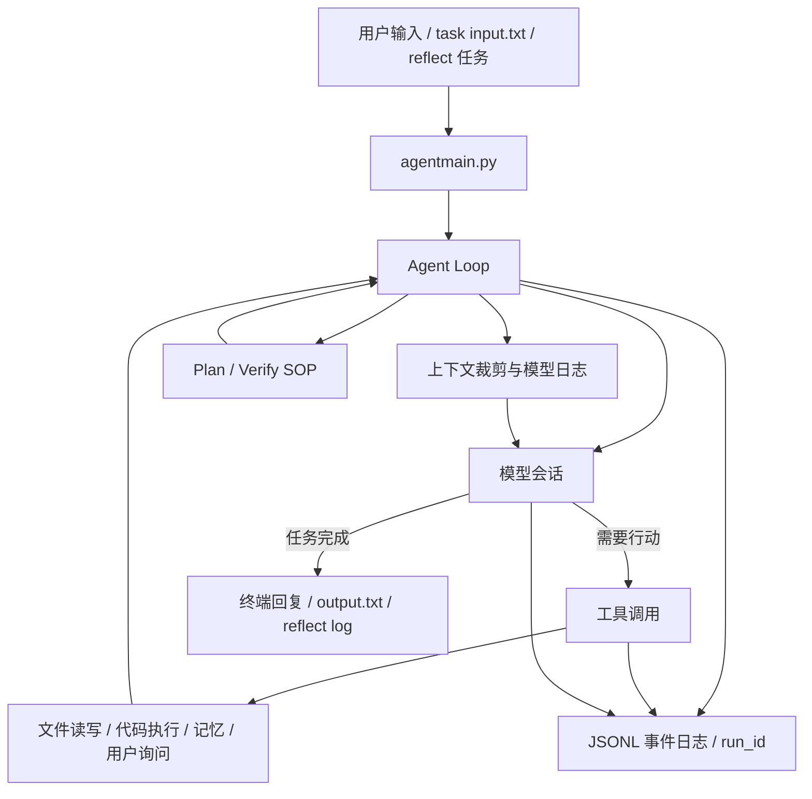

# LocalPilot: 本地通用 Agent

LocalPilot 是一个面向个人电脑和本地工作区运行的通用 Agent。它把模型会话、工具调用、文件读写、代码执行、任务计划、长期记忆和定时触发串成一条本地闭环，让你可以用自然语言驱动一个会在本机做事的命令行助手。

它适合承担这些场景：

- 读取、理解、修改本地项目文件。
- 执行 Python / shell 片段，做排查、整理、批处理和验证。
- 把一次性需求包装成 task 目录，方便脚本或其他程序投喂任务。
- 对复杂任务先拆计划，再逐步执行和自检。
- 通过 reflect / scheduler 长期运行定时任务，沉淀日志和记忆。

LocalPilot 当前优先保证“本地通用 Agent 的任务闭环”可用，而不是做成多端聊天平台、云端服务或浏览器自动化框架。

## 核心能力

- **本地 CLI Agent**：`python runagent.py` 启动交互式 Agent，输入自然语言后由模型决定是否调用工具继续推进。
- **工具执行闭环**：`agent/agent_loop.py` 负责模型响应、工具调用、工具结果回灌和终止控制。
- **文件与代码工具**：`tools/` 提供文件读取、局部补丁、覆盖写入、Python / shell 执行、用户询问和记忆更新。
- **模型会话适配**：`core/session.py` 支持 OpenAI-compatible 与 Claude 风格接口，包含 native tool calling 和文本工具协议 fallback。
- **上下文与记忆**：`core/context.py` 处理历史裁剪和工具消息修复；`memory/` 保存全局记忆、SOP 和历史会话压缩流程。
- **任务模式**：`--task` 把输入和输出落盘到 `temp/<task>/`，适合被脚本、调度器或其他本地系统调用。
- **计划与反射**：Plan / Verify SOP 支撑复杂任务拆解；`--reflect` 可加载定时或自主触发脚本。
- **结构化日志与异常恢复**：`core/observability.py` 为每次用户可见任务生成 `run_id`，把任务、模型请求、工具调用、异常和耗时写入 JSONL。

## 工作方式



一次任务通常会经历多轮：模型先生成回复或工具调用，工具把真实执行结果回灌给模型，Agent 再根据结果继续读取、修改、运行、验证或结束。

每次用户输入、task 轮次或 reflect 触发都会生成一个新的 `run_id`。同一任务内的 LLM turn、工具调用、retry、异常和任务结束事件都会挂在这个 `run_id` 下，方便用 `rg <run_id> temp/logs` 串起一次执行。

需要注意：Agent 工具的默认工作目录是 `temp/`。如果任务要操作项目根目录文件，请在提示中明确路径，例如 `../README.md` 或绝对路径。

## 快速开始

建议使用 Python 3.11+。

```bash
python -m venv .venv
source .venv/bin/activate
pip install -r requirements.txt
```

可选能力：

```bash
pip install langfuse yara-python
```

模型配置优先读取项目根目录的 `mykey.py`，如果不存在则回退到 `core/mykey.json`。配置变量名需要包含 `api`、`config` 或 `cookie` 之一，入口会据此加载会话。

OpenAI-compatible 示例：

```python
native_oai_config = {
    "name": "local-agent-oai",
    "apikey": "YOUR_API_KEY",
    "apibase": "https://example.com/v1",
    "model": "provider/model-name",
    "api_mode": "chat_completions",
    "stream": True,
    "timeout": 10,
    "read_timeout": 60,
    "context_win": 28000,
    "max_retries": 3,
    "temperature": 1,
    "max_tokens": 8192,
    "reasoning_effort": "medium",
}
```

Claude 风格接口示例：

```python
native_claude_config = {
    "name": "local-agent-claude",
    "apikey": "YOUR_API_KEY",
    "apibase": "https://example.com/v1",
    "model": "claude-compatible-model",
    "stream": True,
    "read_timeout": 60,
    "context_win": 28000,
    "max_retries": 3,
}
```

启动交互模式：

```bash
python runagent.py
```

## 使用方式

### 交互式本地助手

```bash
python runagent.py
```

示例输入：

```text
帮我检查这个项目的核心入口，并总结它如何启动本地 Agent。
```

适合临时排查、阅读项目、修改文件、运行脚本和持续对话。交互模式会流式打印模型输出和工具执行过程。

内置斜杠命令：

- `/resume`：让 Agent 扫描最近的模型会话日志，辅助恢复上下文。
- `/session.<key>=<value>`：临时修改当前会话后端属性，例如模型参数或额外配置。

### 一次性任务

```bash
python runagent.py --task demo --input "读取项目结构，输出核心模块说明"
```

执行后会使用 `temp/demo/` 作为任务目录：

- `input.txt`：任务输入。
- `output.txt` / `output1.txt`：每轮任务输出。
- `reply.txt`：外部程序可写入下一轮输入。
- `_stop`：请求中止当前任务。
- `_intervene`：向运行中的任务追加干预提示。
- `_keyinfo`：注入关键上下文。

后台运行：

```bash
python runagent.py --task demo --bg --input "检查 tools 目录里的工具能力"
```

后台模式会打印 PID，标准输出和错误日志写入 `temp/demo/stdout.log` 与 `temp/demo/stderr.log`。

### 异常处理与结构化日志

LocalPilot 默认把可排障事件写入按天切分的 JSON Lines 文件：

```text
temp/logs/agent-YYYY-MM-DD.jsonl
```

事件日志面向本地排障，不替代 `temp/model_responses/` 的模型原文日志。JSONL 默认只保存摘要和元数据，例如 `event`、`run_id`、`component`、`turn`、`tool_name`、耗时、状态码、错误类型和短消息；不全量记录 prompt、文件内容、工具结果或完整模型回复。异常事件会记录 `exc_type`、`exc_msg`、`traceback`、`recoverable` 和 `user_visible_msg`。

常见事件包括：

- `task_start` / `task_end` / `task_failed`：任务级生命周期。
- `llm_turn_start` / `llm_turn_end` / `llm_turn_exception`：Agent Loop 视角的模型轮次。
- `llm_request_start` / `llm_request_retry` / `llm_request_end` / `llm_request_error` / `llm_usage`：模型请求、重试和用量。
- `tool_start` / `tool_end` / `tool_exception` / `tool_bad_args` / `tool_unknown`：工具分发和工具异常。

日志等级默认写入 `info` 及以上。需要更多细节时可以设置：

```bash
LOCALPILOT_LOG_LEVEL=debug python runagent.py
LOCALPILOT_LOG_STDERR=1 python runagent.py
```

异常处理采用分层策略：

- 工具执行中的普通异常会被 `tools/base.py` 捕获，写入 `tool_exception`，并转成可恢复的 `StepOutcome` 返回给模型继续修正。
- LLM 网络超时、连接错误和可重试 HTTP 状态会按 session 配置重试，并写入 request retry/error 事件。
- 任务级未捕获异常会结束当前任务，用户输出只展示短错误，完整 traceback 进入 JSONL。
- `KeyboardInterrupt` 和 `SystemExit` 不会被工具层吞掉，仍交给外层中止流程处理。

### 复杂任务计划

可以直接用自然语言要求 Agent 先计划再执行：

```text
进入计划模式，帮我重构工具调用链路；先列计划，再逐步修改，最后运行验证。
```

Plan 相关 SOP 位于：

- `memory/plan_sop.md`
- `memory/verify_sop.md`
- `memory/subagent.md`

这条路径适合多文件修改、条件分支、需要独立验证的任务。当前实现依赖模型按 SOP 调用文件、代码和记忆工具，因此更适合可信本地工作区内的工程任务。

### 定时和自主触发

启动定时任务扫描：

```bash
python runagent.py --reflect reflect/scheduler.py
```

启动自主触发脚本：

```bash
python runagent.py --reflect reflect/autonomous.py
```

`reflect/scheduler.py` 会扫描 `sche_tasks/*.json`，在指定时间把任务提示交给 Agent。任务完成报告默认落在 `sche_tasks/done/`，reflect 运行日志落在 `temp/reflect_logs/`。

定时任务配置示例：

```json
{
  "enabled": true,
  "repeat": "daily",
  "schedule": "21:30",
  "max_delay_hours": 6,
  "prompt": "检查今天的模型调用日志，压缩重要结论，并更新长期记忆。"
}
```

`scheduler` 还会周期性调用 `memory/L4_raw_sessions/compress_session.py`，压缩 `temp/model_responses/` 中的历史会话日志。

## 目录说明

```text
agentmain.py        # 根入口，转发到 agent.agentmain
agent/              # CLI 主程序与 Agent Loop
core/               # 模型会话、上下文裁剪、配置、模型原文日志和 JSONL 观测
tools/              # Agent 可调用工具、工具分发基类与 JSON schema
memory/             # 全局记忆、SOP、历史会话压缩
reflect/            # 定时任务和自主触发脚本
sche_tasks/         # scheduler 扫描的任务配置与完成报告
temp/               # task 输出、模型日志、JSONL 事件日志、临时工作目录
assets/             # 系统提示词和记忆模板
tests/              # 当前测试集合，仍在随重构收敛
```

## 模型配置细节

入口会根据配置变量名选择会话类型：

- 名称包含 `native` 和 `oai`：使用 `NativeOAISession`。
- 名称包含 `native` 和 `claude`：使用 `NativeClaudeSession`。
- 名称包含 `oai`：使用 OpenAI-compatible 文本工具协议会话。
- 名称包含 `claude`：使用 Claude 风格文本工具协议会话。
- 名称包含 `mixin`：按配置组合多个会话做 fallback。

Mixin 示例：

```python
mixin_config = {
    "llm_nos": [0, 1],
    "max_retries": 3,
    "base_delay": 1.5,
    "spring_back": 300,
}
```

## 安全边界

- 不要提交真实 API key、cookie 或私有模型网关地址；`mykey.py` 和 `core/mykey.json` 都应按敏感配置处理。
- `temp/`、`temp/model_responses/`、`temp/logs/`、task 输出和 reflect 日志可能包含提示词摘要、工具结果、文件内容、错误信息和调研结论，分享前需要清理。
- JSONL 事件日志会对常见敏感字段名做基础脱敏，并截断普通字符串，但不能替代正式的密钥扫描或数据治理。
- Agent 可以读写文件、应用补丁并执行代码。建议只在可信工作区运行，并在提示中明确操作范围。
- Reflect 和定时任务会长期执行自然语言任务，启用前请检查 `reflect/` 脚本、`sche_tasks/` 配置和报告写入路径。

## 开发状态

当前项目处在“本地通用 Agent 闭环优先”的阶段：

| 能力 | 状态 | 说明 |
| --- | --- | --- |
| 交互式 CLI | 已接入 | `python runagent.py` 启动本地 Agent。 |
| task 文件 I/O | 已接入 | `--task` / `--input` 输出到 `temp/<task>/`。 |
| Agent Loop | 已接入 | 支持多轮模型响应、工具调用、结果回灌和退出控制。 |
| 文件与代码工具 | 已接入 | 覆盖文件读写、补丁、Python / shell 执行和用户询问。 |
| 上下文与记忆 | 已接入 | 支持上下文裁剪、全局记忆注入和模型日志记录。 |
| 结构化日志 | 已接入 | `temp/logs/agent-YYYY-MM-DD.jsonl` 按 `run_id` 串联任务、turn、request、tool 和异常事件。 |
| 异常恢复 | 已接入 | 工具异常局部恢复；模型请求保留 retry；任务级异常输出短错误并记录 traceback。 |
| Plan / Verify SOP | 已有流程 | 面向复杂任务，依赖 Agent 按 SOP 执行。 |
| Reflect / Scheduler | 已接入 | 适合本地定时任务和长期运行流程。 |
| 依赖清单 | 已接入 | `requirements.txt` 包含核心运行依赖，可选依赖在文件中注释标明。 |
| 测试集合 | 待收敛 | `tests/` 中仍有重构遗留用例，需要继续对齐当前模块。 |

可先运行启动参数检查：

```bash
python agentmain.py --help
```
