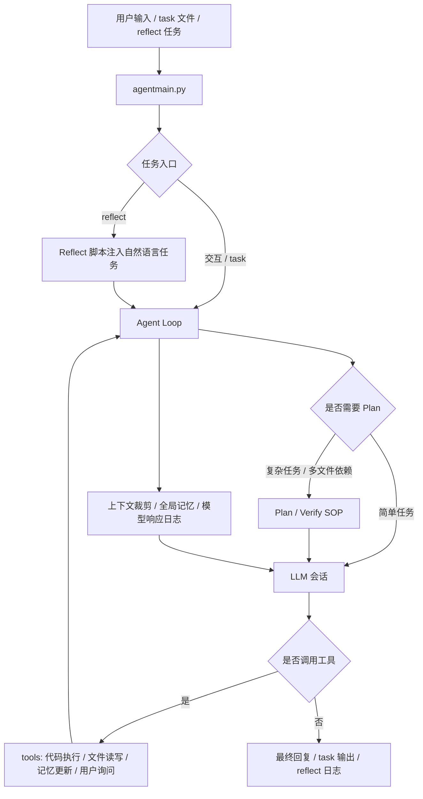

# GA: 本地可演化 Agent Runtime

GA 是一个面向本地运行的可演化 Agent Runtime。它把 LLM 会话、Agent Loop、工具协议、上下文压缩、长期记忆、Plan 模式和 Reflect 任务组织在一起，让一个本地 Agent 能够围绕文件、代码、记忆和任务流程持续工作。

这个项目当前更关注“把一次 Agent 任务可靠地跑起来并沉淀经验”，而不是把所有模型、渠道、浏览器自动化和测试矩阵一次性做满。

## 核心亮点

- **Agent Loop**：`agent_loop.py` 负责多轮模型响应、工具调用、工具结果回灌和退出条件控制。
- **LiteLLM 适配/兼容**：`core/session.py` 面向 OpenAI / Claude 风格接口做会话适配，兼容 native tool calling，并保留文本工具协议 fallback。这里是“面向兼容”的设计，不承诺完整覆盖所有 provider。
- **工具调用系统**：`tools/` 提供代码执行、文件读取、补丁写入、用户询问、工作记忆和长期记忆更新等能力。
- **记忆与压缩**：`memory/` 保存全局记忆和 SOP；`core/context.py` 处理上下文裁剪；`temp/model_responses/` 记录模型交互；`memory/L4_raw_sessions/compress_session.py` 用于历史会话归档压缩。
- **Plan / Reflect**：支持计划模式、任务检查、定时任务和自主触发脚本，把单轮问答推进到可持续任务流程。

## 核心执行闭环



一次任务会在 Agent Loop 中多轮推进：模型给出回复或工具调用，工具结果回灌给模型，必要时更新记忆或进入 Plan/Verify 流程，直到任务完成、退出或等待下一轮输入。

## 快速开始

建议使用 Python 3.11+ 或 Python 3.12。

```bash
python -m venv .venv
source .venv/bin/activate
pip install requests urllib3 litellm
```

可选能力按需安装：

```bash
pip install langfuse yara-python
```

配置模型密钥。当前主入口 `agentmain.py` / `llmcore.py` 会读取根目录 `mykey.py` 或 `mykey.json`。示例：

```python
native_claude_dash_config = {
    "name": "demo-model",
    "apikey": "YOUR_API_KEY",
    "apibase": "https://example.com/v1",
    "model": "your-model-name",
    "stream": True,
    "read_timeout": 60,
    "context_win": 28000,
    "max_retries": 3,
}
```

`core.*` 重构模块和 `t.py` 读取 `core/config/mykey.py` 或 `core/config/mykey.json`。如果只运行 `agentmain.py`，优先确认根目录配置可用。

启动交互模式：

```bash
python agentmain.py
```

## Demo

Demo 不要求用户总是记住内部模式名。普通对话、Plan 模式和 Reflect 模式都可以从自然语言任务开始：Agent 会根据任务是否复杂、是否包含未来时间、是否需要读写文件或生成报告，决定是直接执行、进入 Plan 流程，还是交给 Reflect/定时任务路径处理。

### 普通对话

```bash
python agentmain.py
```

启动后直接输入问题：

```text
> 帮我总结一下这个项目的核心模块
```

预期结果：终端持续打印模型回复和必要的工具调用过程；如果模型需要读取文件，会通过工具访问项目文件并把结果回灌到对话中。

### 一次性任务模式

```bash
python agentmain.py --task demo --input "读取项目结构，并总结核心入口"
```

后台运行：

```bash
python agentmain.py --task demo --bg --input "检查 tools 目录里的工具能力"
```

`python agentmain.py --task demo --input "..."` 是当前真实 CLI。它会创建或使用 `temp/demo/`，把输入写入 `input.txt`，清理旧的 `output*.txt`，调用配置好的模型执行任务，并把结果写入 `output.txt` 或后续轮次的 `output1.txt` 等文件。前提是根目录 `mykey.py` 或 `mykey.json` 中的模型配置有效。

预期结果：命令结束后可在 `temp/demo/output.txt` 查看本轮任务结果；如果使用 `--bg`，命令会打印后台进程 PID，标准输出和错误日志会写到 `temp/demo/stdout.log` 和 `temp/demo/stderr.log`。

### Plan 模式

可以在交互模式中要求 Agent 先进入计划流程：

```text
进入计划模式，帮我拆解并执行：为这个项目补一个 README，并在完成前自检路径和命令是否准确。
```

也可以直接用自然语言描述一个需要拆解、执行和验证的复杂任务，Agent 会根据任务语义判断是否需要进入 Plan 流程，并调用对应的计划/验证 SOP。通常当任务步骤超过三个、依赖文件较多，或需要跨模块修改与验证时，Agent 会自动触发 Plan 模式，先形成执行计划，再分步推进。

示例：

```text
帮我重构工具调用链路，涉及 handler、schema 和 session 的地方都要检查，完成后跑测试。
```

```text
检查这个项目的记忆压缩流程，找出入口、数据流、失败边界，并给出可执行的改进方案。
```

计划相关 SOP 位于 `memory/plan_sop.md`、`memory/verify_sop.md` 等文件中，工具层会通过工作记忆保存关键约束，降低长任务中丢上下文的概率。

预期结果：Agent 会先拆解任务、记录关键约束，再按步骤读取文件、调用工具、执行验证；任务复杂时不会只给一次性回答，而是围绕计划持续推进。

### Reflect 模式与长期记忆压缩

定时任务反射：

```bash
python agentmain.py --reflect reflect/scheduler.py
```

自主触发脚本：

```bash
python agentmain.py --reflect reflect/autonomous.py
```

Reflect 模式下，触发脚本会把定时任务、自主任务或外部文件中的自然语言任务描述交给 Agent；Agent 再根据描述自动调用工具、记忆、计划或报告写入流程。

这类任务可以保持自然语言形态，例如：

```text
明早为我创建一个新的调研记录文件，并写入初始提纲。
```

```text
今天晚上完成一次 README 对标调研任务，并把结论写到报告路径。
```

```text
每个工作日晚上检查今天的模型调用日志，压缩重要结论，并更新长期记忆。
```

如果这些任务来自 `sche_tasks/` 的 JSON 配置，`reflect/scheduler.py` 会在设定时间把其中的 `prompt` 交给 Agent；后续是否读文件、写报告、进入 Plan 模式或更新记忆，由 Agent 根据任务描述和当前上下文自动判断。

`reflect/scheduler.py` 会周期性调用 `memory/L4_raw_sessions/compress_session.py`，对 `temp/model_responses/` 下的原始会话日志做 L4 归档压缩。它也会扫描 `sche_tasks/` 中启用的任务配置。

预期结果：Reflect 进程会长期运行并按脚本规则触发任务；结果打印到控制台，同时写入 `temp/reflect_logs/`，定时任务也可能按提示把报告写入 `sche_tasks/done/` 下的指定路径。

## 核心目录

```text
agentmain.py        # CLI 入口、交互模式、task 模式、reflect 模式
agent_loop.py       # Agent Loop：模型调用、工具调用、结果回灌
core/               # 会话、上下文、配置、工具协议等重构模块
tools/              # Agent 可调用工具与 schema
memory/             # 全局记忆、SOP、历史压缩流程
reflect/            # 定时/自主触发脚本
sche_tasks/         # scheduler 扫描的任务配置目录
temp/               # 任务输出、模型日志、临时文件
plugins/            # 可选插件，例如 Langfuse tracing
tests/              # 当前单元测试
```

## 设计取舍

当前优先级是本地 Agent Runtime：可靠地组织一次任务中的模型、工具、记忆、文件 I/O 和执行反馈。这让项目可以先形成清晰的运行闭环，再逐步扩展外部入口。

项目暂不把完整多渠道接入作为核心目标。CLI、文件 I/O 和 reflect 脚本已经覆盖当前主要使用路径，过早拉宽到聊天平台、Web 服务和多端协议会增加协议面和状态复杂度。

项目也不承诺复杂浏览器控制。当前 `web_tools` 相关导入在工具层处于注释状态，浏览器自动化不是主路径能力。

测试状态会如实记录，而不是包装成“全量绿灯”。当前更重要的是标清已验证路径和遗留边界，方便后续收敛。

## 配置说明

常见模型配置字段：

```python
native_oai_config = {
    "name": "openai-compatible-demo",
    "apikey": "YOUR_API_KEY",
    "apibase": "https://example.com/v1",
    "model": "provider/model-or-model-name",
    "stream": True,
    "timeout": 10,
    "read_timeout": 60,
    "context_win": 28000,
    "max_retries": 3,
    "temperature": 1,
    "max_tokens": 8192,
    "reasoning_effort": "medium",
}
```

Mixin / fallback 配置可把多个会话组合起来，在主模型失败时切换到备用模型。具体字段以 `llmcore.py` 和 `core/session.py` 当前实现为准。

可选 Langfuse tracing：

```python
langfuse_config = {
    "public_key": "YOUR_PUBLIC_KEY",
    "secret_key": "YOUR_SECRET_KEY",
    "host": "https://cloud.langfuse.com",
}
```

## 安全提示

- 不要提交真实 API key、cookie 或私有模型网关地址；`mykey.py`、`mykey.json` 和 `core/config/mykey.py` 都应按敏感配置处理。
- `temp/`、`temp/model_responses/`、task 输出和 reflect 日志可能包含提示词、工具结果、文件内容或调研结论，分享前需要清理。
- Agent 具备文件读写、补丁和代码执行能力，建议只在可信工作区运行，并在执行高风险任务前确认当前目录。
- Reflect 和定时任务会持续执行自然语言任务，启用前请检查 `reflect/` 脚本、`sche_tasks/` 配置和报告写入路径。

## 开发与测试状态

当前可单独运行并通过的测试：

```bash
python -m unittest tests/test_session.py -v
```

当前完整 discover 仍有遗留失败：

```bash
python -m unittest discover -s tests -v
```

失败原因是 `tests/test_llm_client.py` 仍引用已删除的 `core.llm_client`。这属于测试体系和旧模块清理的后续收敛项，本 README 不把它描述为已完成状态。

## 当前完成度

| 分类     | 能力/事项                          | 当前状态         | 说明/边界                                                    |
| -------- | ---------------------------------- | ---------------- | ------------------------------------------------------------ |
| 主路径   | 交互式 Agent CLI                   | 已形成可运行骨架 | `python agentmain.py` 启动本地交互入口。                     |
| 主路径   | task 文件 I/O 模式                 | 已形成可运行骨架 | `--task` / `--input` 面向外部脚本协作，输出落在 `temp/<task>/`。 |
| 主路径   | Agent Loop                         | 已形成可运行骨架 | 支持多轮模型响应、工具调用、结果回灌和退出控制。             |
| 主路径   | 工具调用系统                       | 已形成可运行骨架 | 覆盖代码执行、文件读写、补丁、用户询问和记忆更新。           |
| 主路径   | 模型会话适配                       | 已形成可运行骨架 | 面向 OpenAI / Claude 风格接口做适配/兼容，保留文本工具协议 fallback。 |
| 主路径   | 上下文裁剪与记忆                   | 已形成可运行骨架 | 支持上下文压缩、全局记忆注入和模型响应日志记录。             |
| 扩展路径 | reflect 定时/自主触发              | 已接入主入口     | 通过 `--reflect` 加载脚本触发任务，适合本地自动化流程。      |
| 扩展路径 | Plan / Verify / Scheduled Task SOP | 已有流程文件     | 可支撑复杂任务拆解、验证和定时任务执行，仍依赖 Agent 按 SOP 调用。 |
| 扩展路径 | 长期记忆归档                       | 已有处理流程     | `memory/L4_raw_sessions/compress_session.py` 面向历史会话压缩归档。 |
| 扩展路径 | Langfuse tracing                   | 可选插件         | 配置 `langfuse_config` 后尝试启用，不作为核心运行前提。      |
| 扩展路径 | 多模型 fallback / mixin            | 已有机制         | 可组合多个会话作为备用路径，具体稳定性取决于模型配置。       |
| 待收敛项 | 依赖清单                           | 待收敛           | 尚未整理成 `requirements.txt` 或 `pyproject.toml`。          |
| 待收敛项 | 新旧会话模块并行                   | 待收敛           | 根目录 `llmcore.py` 与 `core/session.py` 仍存在职责重叠。    |
| 待收敛项 | 多渠道入口                         | 非当前主目标     | 暂不把聊天平台、Web 服务和多端协议作为核心闭环。             |
| 待收敛项 | 复杂浏览器控制                     | 非主路径         | `web_tools` 相关导入仍处于注释状态。                         |

## 后续计划

- 为 task / reflect / memory 压缩补更小颗粒度的回归测试。
- 明确多模型配置示例，继续保持“适配/兼容”表述，避免过度承诺。
- 在需要时再评估多渠道入口和浏览器自动化，而不是把它们提前放进核心闭环。