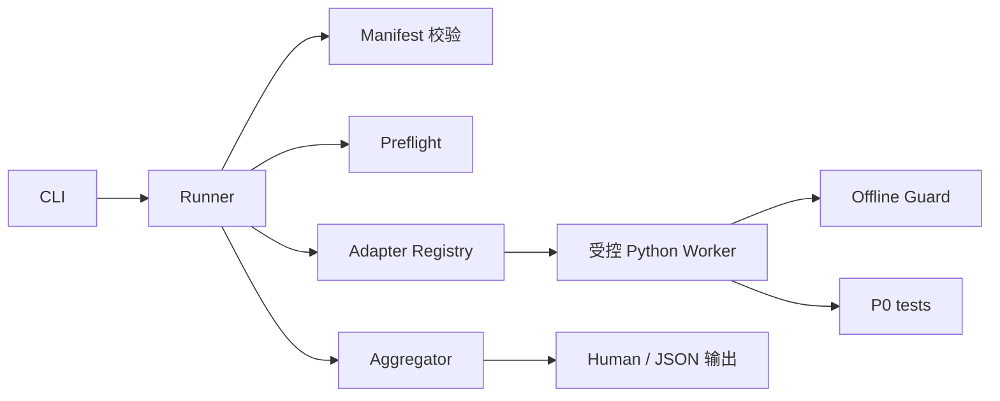

# LocalPilot P0 个人项目版技术设计

## 文档信息

| 字段 | 内容 |
| --- | --- |
| 项目 | LocalPilot |
| 阶段 | P0 — 可验证工程基线 |
| 文档类型 | Technical Design |
| 状态 | Replanned / 待用户确认 |
| 重写日期 | 2026-07-20 |
| Requirements | [p0-verifiable-engineering-baseline-requirements.md](./p0-verifiable-engineering-baseline-requirements.md) |
| Implementation Plan | [p0-verifiable-engineering-baseline-implementation-plan.md](./p0-verifiable-engineering-baseline-implementation-plan.md) |

## 1. 设计目标

本设计把 P0 收缩成一个个人开发使用的本地体检工具：

```bash
python -m p0_baseline
```

它复用已经完成的工程组件，只补齐结果聚合、最小 Runner、CLI 输出和一个产品帮助入口烟雾检查。

完成后的数据流很简单：



P0 不成为产品运行时的一部分，也不改变 Agent、Session、Client、上下文、工具或 Provider 的业务流程。

## 2. 设计原则

1. **复用现有实现。** Manifest、Schema、模型、脱敏、Preflight、Worker、Adapter、Offline Guard 和 Safe Subprocess 全部保留。
2. **只做一条纵向闭环。** Runner 负责串联组件，不再增加编排框架、插件系统或证据服务。
3. **没有跑完就不是成功。** skip、timeout、中断、结果缺失和 dirty 工作树都进入 incomplete。
4. **明确失败优先。** 已观察到的检查失败不能被 incomplete 条件掩盖。
5. **默认离线。** Runner 必须在父进程执行任何 Adapter 前安装 Offline Guard，Worker 也必须在导入测试模块前安装自己的 Guard。
6. **不借体检重构产品。** 产品问题先报告，结构性修改另立计划。
7. **旧数据兼容但不主导新结论。** 旧 56/62 Requirement 映射可以保留，不再决定个人项目版 P0 是否完成。

## 3. 已有组件与改动范围

### 3.1 原样保留的组件

| 组件 | 文件 | 继续承担的职责 |
| --- | --- | --- |
| Contract Models | `p0_baseline/models.py` | 状态、检查结果、环境快照和报告序列化 |
| Errors | `p0_baseline/errors.py` | 稳定错误码 |
| Manifest Loader | `p0_baseline/manifest.py` | Manifest、资产、Adapter 和 test ID 校验 |
| Manifest / Schema | `p0_baseline/manifest.json`, `schemas/**` | 已登记资产、检查和 JSON 结构 |
| Preflight | `p0_baseline/preflight.py` | revision、dirty、环境、依赖和代码来源检查 |
| Redaction | `p0_baseline/redaction.py` | 输出前敏感信息脱敏 |
| Worker | `p0_baseline/check_worker.py` | 精确 unittest ID 执行和结构化结果 |
| Adapter / Registry | `p0_baseline/adapters.py`, `registry.py` | 将 Worker 结果转换成 `CheckResult` |
| Offline Boundary | `p0_baseline/offline.py` | 阻止默认外部网络访问 |
| Safe Subprocess | `p0_baseline/safe_subprocess.py` | 只启动当前 Python 的受控 Worker |

这些组件可以为新 Requirements 做小范围兼容调整，但不删除其已有安全检查和测试。

### 3.2 本轮新增或补齐

| 组件 | 文件 | 最小职责 |
| --- | --- | --- |
| Aggregator | `p0_baseline/aggregation.py` | 纯函数计算 Summary、三态和退出码 |
| Runner | `p0_baseline/runner.py` | 串联 Manifest、Preflight、检查执行和聚合 |
| CLI | `p0_baseline/cli.py`, `__main__.py` | 参数、human/json 输出和进程退出 |
| Product Smoke | `tests/p0/behavior/test_product_help.py` | 离线验证 `runagent.py --help` |
| Guide | `P0_BASELINE.md` | 运行方法、状态含义和限制 |

首版不新增 `evidence.py`。文件输出属于 CLI 的一个小函数，不建设独立 Evidence Sink。

## 4. 运行流程

### 4.1 CLI

保留命令：

```text
python -m p0_baseline [--format human|json] [--output PATH]
```

规则：

- `--help` 只构造参数解析器，不构造 Runner，也不加载产品 Provider 配置；
- 默认格式为 human；
- JSON stdout 只输出一个 JSON 对象，不混入进度文字或 ANSI；
- human 输出最后一行明确显示 `SUCCESS`、`FAILURE` 或 `INCOMPLETE`；
- CLI 返回 Aggregator 给出的 `0 / 1 / 2`；
- 参数错误继续使用 argparse 的标准退出行为，不伪装成一次 P0 运行结果。

### 4.2 Runner

Runner 使用同步、稳定顺序执行，不引入并发。流程为：

1. 定位 repository root；
2. 加载 Manifest；
3. 校验 Manifest 与当前 `HEAD` 中的必需资产；
4. 执行 Preflight，取得环境快照和净化后的 Worker 环境；
5. 为每个必需检查预先建立 `not_run` 占位结果；
6. 安装父进程 Offline Guard，并在其保护下按 Manifest 顺序通过 Registry 调用 Adapter；
7. Worker 在自己的进程中继续安装 Offline Guard，形成父/子进程两层边界；
8. 检查失败后继续执行其他独立检查；
9. 遇到中断后停止启动新检查，保留当前结果，其余保持 `not_run`；
10. 调用 Aggregator 计算最终状态；
11. 脱敏并构造输出对象；
12. 按 CLI 参数输出到 stdout，并可选写入文件。

Runner 不安装依赖、不修改工作区、不自动提交、不访问真实 Provider。

### 4.3 Check Worker

继续使用现有边界：

- Runner 只能通过 `safe_subprocess.run_worker()` 启动 Worker；
- 只能使用当前 `sys.executable`；
- Worker 环境必须由 Preflight 净化；
- Offline Guard 在加载测试模块之前安装；
- 请求使用精确 dotted unittest ID；
- Worker 只返回结构化结果，不返回 assertion 原文或 traceback；
- timeout、结果文件缺失、非法 JSON 和退出异常由 Adapter 转换为非成功状态。

## 5. 状态设计

### 5.1 CheckStatus 到总体状态

只统计 `required=true` 的检查：

| 观察结果 | 总体影响 |
| --- | --- |
| `passed` | 可以继续判断 success |
| `failed` | failure |
| `error` | failure |
| `skipped` | incomplete |
| `not_run` | incomplete |
| `interrupted` | incomplete |

非必需检查可以记录，但不改变总体状态。

### 5.2 Preflight 与运行级资格门

| 条件 | 总体影响 |
| --- | --- |
| 不支持的环境 | failure |
| 依赖指纹不匹配 | failure |
| 必需资产缺失或不属于 `HEAD` blob | failure |
| 核心代码来源不属于当前检出 | failure |
| 外部网络访问尝试 | failure |
| dirty 工作树 | incomplete |
| Worker 环境仍含个人凭证 | incomplete，并且不得启动 Worker |
| 指定输出文件写入失败 | incomplete；若已有确定失败则仍为 failure |

### 5.3 聚合优先级

Aggregator 是不做 I/O 的纯函数，规则固定为：

```text
存在确定失败       -> failure / 1
否则存在未完成条件 -> incomplete / 2
否则全部必需检查通过 -> success / 0
```

空检查集合不能 success。Summary 由检查结果计算，不接受调用方传入另一份计数。

## 6. 输出设计

### 6.1 内存结果

Runner 返回一个不可变运行结果，至少包含：

- revision 与 Manifest digest；
- 环境快照；
- 按 Manifest 顺序排列的检查结果；
- Summary；
- overall status 与 exit code；
- 运行级诊断；
- redaction 摘要。

优先复用现有 `BaselineReport`。不新增第二套意义相同的报告模型。

### 6.2 旧 Requirement 映射兼容

现有 `BaselineReport` 和 Manifest 仍带有旧版 `requirement_coverage`，并且模型当前把 56 条历史编号作为 success 条件。本轮调整方式为：

1. 保留字段、JSON 结构和现有历史数据；
2. Manifest 只返回实际存在的历史映射，并继续校验 ID 格式、唯一性、稳定顺序和 check ID 引用一致性；
3. 从 `BaselineReport` 的 success 不变量中移除“必须拥有旧 56 条编号”的要求；
4. success 只依赖必需检查、环境、离线、凭证和工作树资格门；
5. 输出文档把旧映射标记为 `legacy_coverage` 语义，不称其为当前 32 条 Requirements 的通过证明。

该调整不删除现有代码或测试资产，但相关模型测试必须改为验证新的成功条件。

### 6.3 Human 与 JSON

Human 输出面向个人排障，最少显示：状态、退出码、通过/失败/未完成数量、失败检查和安全诊断。

JSON 使用现有报告的 `to_dict()` 结果，经 `redact()` 后再序列化。相同运行的 human 与 JSON 必须表达相同结论。

### 6.4 可选文件输出

`--output PATH` 的首版规则：

- 写入内容与 JSON stdout 的对象一致；
- 写入前完成模型、Schema 和脱敏校验；
- 使用 UTF-8 和确定性 JSON 序列化；
- 创建父目录失败、权限失败或写入失败时产生运行级诊断；
- 写入失败不能返回 success；
- 不实现证据目录、fsync、发布回读、历史报告管理或自动清理。

## 7. 最小产品烟雾检查

### 7.1 验证目标

只验证一个产品行为：`runagent.py --help` 能在无凭证、无外网的环境中成功返回。

不在本轮验证对话、模型响应、重试、多工具、上下文裁剪或真实任务执行。

### 7.2 执行方式

烟雾检查作为精确 unittest ID 注册到 Manifest。它既可能被 unittest discovery 直接执行，也可能由现有 Worker 执行，因此测试自身必须建立第一层安全边界，Worker 提供第二层防御：

1. 测试使用 `sanitized_worker_env()` 临时替换环境，并显式进入 `offline_guard()`；
2. 测试将 `reload_mykeys()` 替换为调用即失败的桩；
3. 测试临时设置 `sys.argv = ["runagent.py", "--help"]`；
4. 使用 `runpy.run_path()` 执行当前仓库根目录下的 `runagent.py`；
5. 捕获 argparse 的 `SystemExit(0)` 和 stdout；
6. 断言帮助文本非空且退出码为 0；
7. 由 Preflight 和 HEAD blob 校验保证入口及核心模块来自当前检出；
8. 无论成功或异常，最后恢复 `os.environ`、`sys.argv`、stdout 和 stderr。

不为该检查启动第二种不受控子进程，也不修改产品入口。

## 8. 测试设计

### 8.1 单元测试

- `test_aggregation.py`：完整三态真值表、失败优先、空集合、非必需检查；
- 现有模型、Manifest、Preflight、Redaction、Offline、Worker、Adapter 和 Safe Subprocess 测试继续运行；
- 调整 `BaselineReport` 测试，使旧 56 条映射不再是 success 的必要条件，但字段兼容仍被覆盖；
- CLI 测试覆盖 help 不构造 Runner、格式选择和退出码。

### 8.2 集成测试

使用 fake Manifest/Registry 或受控 fixture 验证三条流程：

- 全部通过 -> success / 0；
- 任一明确失败 -> failure / 1；
- dirty、skip、timeout、中断或缺失结果 -> incomplete / 2。

同时验证检查顺序、失败保留、脱敏和输出写入失败。

Runner 集成测试不得调用真实 P0 主入口或当前活动 Manifest，也不得登记进 Runner 自己执行的 Manifest。

### 8.3 行为测试

只新增 `runagent.py --help` 烟雾检查。该测试必须在直接 discovery 和 Worker 两条路径中都离线、无凭证，并验证当前检出来源。

### 8.4 完整验证命令

```bash
.venv/bin/python -m unittest discover -s tests/p0 -t .
.venv/bin/python -m compileall -q p0_baseline tests/p0
.venv/bin/python -m p0_baseline --help
.venv/bin/python -m unittest <dirty-semantic-verification-test>
```

上述自动质量门必须全部退出 `0`。最后一个外层测试内部运行真实 P0，断言 dirty 工作树下返回 incomplete / `2` 且唯一资格阻塞为 dirty；外层测试自身退出 `0`，并且不得登记进活动 Manifest。裸 P0 命令只作为人工观察，不得为了得到 `0` 而清理用户文件。

## 9. 文件边界

### 9.1 允许新增或修改

```text
p0_baseline/aggregation.py
p0_baseline/runner.py
p0_baseline/cli.py
p0_baseline/__main__.py
p0_baseline/models.py
p0_baseline/manifest.py
p0_baseline/manifest.json
p0_baseline/schemas/*.json
tests/p0/**
P0_BASELINE.md
README.md
```

`models.py`、`manifest.py` 和 Schema 只允许为旧映射兼容做最小调整。

### 9.2 默认禁止修改

```text
agent/**
core/**
tools/**
runagent.py
config/**
```

如果烟雾检查失败，先记录失败证据。只有用户确认属于 P0 内的小兼容修复后才能修改产品文件；结构重构必须停止并另立计划。

## 10. 明确延后

- 全量产品行为特征测试；
- 62 条 Requirement 认证；
- hostile import / native 强沙箱；
- 独立 Evidence Sink；
- clean clone 与 candidate revision 自动化；
- 重复运行报告比较器；
- 在线 Provider smoke；
- CI、并发和性能优化。

## 11. 设计完成判定

实现满足以下条件即可认为本设计落地：

- CLI、Runner、Aggregator 形成可运行闭环；
- 现有安全组件被复用，没有平行实现；
- 三态及退出码符合 Requirements 4；
- 默认离线和凭证净化生效；
- `runagent.py --help` 烟雾检查通过；
- 旧 Requirement 映射不再阻塞个人项目版 success，也没有被破坏性删除；
- P0 测试和 compile check 通过；
- 没有修改 LocalPilot 的用户可见业务语义。

本文件替代旧版企业级 P0 Design。用户确认后，后续实现以本设计为准。
