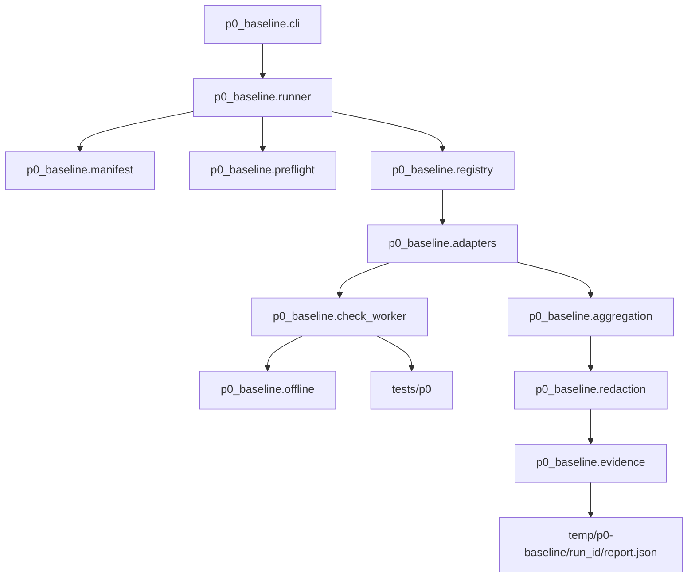

# P0 可验证工程基线技术 Design

## 文档信息

| 字段 | 内容 |
| --- | --- |
| 项目 | LocalPilot |
| 阶段 | P0 — 可验证工程基线 |
| 文档类型 | Technical Design |
| 状态 | Design Generated / 待用户确认 |
| 上游需求 | [p0-verifiable-engineering-baseline-requirements.md](./p0-verifiable-engineering-baseline-requirements.md) |
| 接口契约 | [p0-verifiable-engineering-baseline-interface-contracts.md](./p0-verifiable-engineering-baseline-interface-contracts.md) |
| 语言 | 中文 |

## 1. 设计目标

本 Design 补齐接口契约留给实现阶段的绑定决策，使实现任务不需要自行猜测：

- `p0-verify` 的具体仓库命令；
- Manifest 和报告 Schema 的文件路径与格式；
- Runner、Preflight、Offline Boundary、Check Adapter 和 Evidence Sink 的组件边界；
- 父进程及受控子进程的离线保证方式；
- 当前本机历史测试到 P0 必需测试的迁移与排除规则；
- 首版受支持环境和依赖复现方案。

本 Design 不实现 Session/Client 重构，不改变现有 Agent 产品工作流，也不引入在线 Provider 验收。

## 2. 当前约束与设计输入

### 2.1 已确认事实

- 根启动器为 `runagent.py`，转发到 `agent.agent_runtime`。
- 当前产品 CLI 没有 P0 所需的 `success/failure/incomplete` 三态退出语义。
- `config/paths.py` 已使用模块位置锚定项目根目录。
- 当前环境为 Darwin arm64、CPython 3.12.13。
- `requirements.txt` 使用宽松下限，不能单独证明等价依赖集合。
- `.gitignore` 当前忽略整个 `tests/`，而 `temp/` 的忽略规则被本机修改注释掉。
- HEAD 中没有测试资产；本机历史测试存在大量已删除模块或入口引用。
- `core/observability.py` 的 JSONL 适合排障，但写入失败不会影响产品运行，不能成为权威 P0 证据。
- `agent/agent_loop.py`、`core/context.py` 和 `.gitignore` 存在用户未提交修改，实现时必须保留并逐项协调。

### 2.2 设计原则

1. P0 验收控制面与产品运行时分离。
2. 权威状态只由 Runner 聚合，测试框架退出码和产品日志均不是最终结论。
3. 默认离线在测试代码加载前生效。
4. 必需测试只使用受版本控制的 P0 资产和受控输入。
5. 首版只声明已经能够在干净环境证明的支持矩阵。
6. 历史测试必须迁移、重写或显式排除，不通过恢复重复入口来保留错误断言。
7. 组件使用 Python 类型标注，并在所有文件、JSON 和子进程边界验证输入。

## 3. 核心设计决策

### 3.1 命令和包绑定

逻辑命令 `p0-verify` 绑定为：

```bash
python -m p0_baseline
```

理由：

- 不修改 `runagent.py` 的产品参数和任务退出语义；
- 从仓库根目录即可执行，不要求先安装 console script；
- `python -m` 能明确使用当前受支持环境中的解释器；
- 包入口便于单元测试和子进程复用。

必需参数：

```text
--format human|json
--output <path>
--help
```

P0 不实现 `--online-smoke`。接口契约中的在线规则保留为未来可选扩展；当前条件不成立。

### 3.2 受支持环境

首版支持矩阵固定为：

```text
OS: Darwin
Architecture: arm64
Runtime: CPython 3.12.x
```

其他 OS、架构或 Python 次版本在完成独立干净检出验收后才能加入 Manifest。README 中现有“Python 3.11+”表述必须改为区分“产品建议环境”和“P0 已验证环境”。

### 3.3 依赖复现

- 保留 `requirements.txt` 作为产品依赖声明。
- 新增 `requirements-p0.lock`，记录 P0 环境所需的完整、精确版本和安装哈希。
- P0 环境准备使用 `python -m pip install --require-hashes -r requirements-p0.lock`。
- Runner 不执行依赖安装；它只比较当前环境的规范化依赖指纹与 Manifest 声明。
- P0 自身优先使用标准库；测试框架使用 `unittest`，不引入 pytest。

### 3.4 Manifest 和 Schema

| 资产 | 路径 | 格式 |
| --- | --- | --- |
| P0 Manifest | `p0_baseline/manifest.json` | UTF-8 JSON |
| Manifest Schema | `p0_baseline/schemas/manifest.schema.json` | JSON Schema |
| Report Schema | `p0_baseline/schemas/report.schema.json` | JSON Schema |
| 历史测试分类 | `plan/p0-test-asset-classification.md` | Markdown |
| P0 验证指南 | `P0_BASELINE.md` | Markdown |
| 范围审计 | `plan/p0-scope-audit.md` | Markdown |

Manifest 在接口契约字段基础上增加以下向后兼容字段：

| 字段 | 类型 | 用途 |
| --- | --- | --- |
| `adapter` | string | 固定为已注册 Adapter 名称，首版支持 `unittest` 和 `internal` |
| `test_ids` | string[] | `unittest` Adapter 要执行的精确测试 ID |
| `allow_loopback` | boolean | 默认 `false`；只有受控本机 fixture 可设为 `true` |
| `supported_environment_id` | string | 绑定首版支持矩阵 |

Manifest 不允许任意 shell command 字段，避免 P0 检查绕过受控进程和离线边界。

### 3.5 权威报告

默认报告路径：

```text
temp/p0-baseline/<run_id>/report.json
```

`temp/` 必须恢复为忽略的运行时目录。报告采用接口契约 `BaselineReport`，写入流程为：

1. 生成完全脱敏的内存对象；
2. 执行类型和 Schema 校验；
3. 写入同目录临时文件；
4. flush 和 fsync；
5. 使用原子替换发布 `report.json`；
6. 重新读取并校验；
7. 仅在成功回读后允许总体 `success`。

## 4. 架构



### 4.1 调用顺序

1. CLI 解析参数，但不加载任何产品 Provider 配置。
2. Manifest 完成 Schema、资产、Requirement 和 Adapter 校验。
3. Preflight 获取修订、工作树、运行时、依赖和代码来源快照。
4. Runner 按 Manifest 稳定顺序调用 Adapter。
5. 每个必需测试由独立 Python Check Worker 执行。
6. Worker 在导入测试模块前安装 Offline Guard。
7. Adapter 将 Worker 结果归一化为 `CheckResult`。
8. Aggregator 生成三态结论和退出码。
9. Redaction 处理报告对象，Evidence Sink 原子持久化。
10. CLI 输出 human 或纯 JSON 结果并返回 `0/1/2`。

## 5. 组件设计

### 5.1 Contract Models

文件：

- `p0_baseline/models.py`
- `p0_baseline/errors.py`

职责：

- 定义 `BaselineStatus`、`CheckStatus`、`Diagnostic`、`CheckResult`、`EnvironmentSnapshot`、`RequirementCoverage` 和 `BaselineReport`。
- 定义接口契约中的稳定错误码。
- 提供 `to_dict()` / `from_dict()` 和边界校验。
- 保证状态与退出码、Summary 计数和必需字段一致。

模型层不读取文件、不执行检查、不决定环境是否支持。

### 5.2 Manifest Loader

文件：

- `p0_baseline/manifest.py`
- `p0_baseline/manifest.json`
- `p0_baseline/schemas/manifest.schema.json`

职责：

- 读取并验证 Manifest Schema；
- 拒绝重复 `check_id`、未知 Requirement ID、绝对路径、`..` 路径和未知 Adapter；
- 验证每个必需资产被 Git 跟踪；
- 验证第 1 至第 9 项的 56 条 Acceptance Criterion 均有 Manifest 检查覆盖；
- 第 10 项的 6 条完成条件不进入普通 CheckDescriptor，避免“先证明总体成功才能计算总体成功”的循环依赖；Runner 在聚合后根据 clean/offline/完整性/范围/追踪门合成其 RequirementCoverage；
- 最终 BaselineReport 必须覆盖全部 62 条 Acceptance Criterion；
- 计算稳定 Manifest SHA-256 摘要；
- 以 Manifest 顺序返回不可变 CheckDescriptor 集合。

### 5.3 Environment Preflight

文件：`p0_baseline/preflight.py`

职责：

- 使用当前仓库本地 Git 命令获得完整 revision 和工作树状态；
- 区分受版本控制资产、忽略的运行时资产和未跟踪资产；
- 校验 Darwin arm64 / CPython 3.12.x；
- 从 `importlib.metadata` 生成排序后的 `name==version` 依赖指纹；
- 用 `importlib.util.find_spec()` 获得核心模块来源，不通过导入触发 Provider 配置；
- 确认核心来源全部位于当前 repository root；
- 记录 `personal_credentials_loaded=false`，且不读取凭证值。

工作树非 clean 不产生确定功能失败，但使 `acceptance_eligible=false`，总体至多为 `incomplete`。

### 5.4 Offline Boundary

文件：

- `p0_baseline/offline.py`
- `p0_baseline/safe_subprocess.py`
- `p0_baseline/check_worker.py`

设计边界：

1. Runner 本身在执行检查前安装父进程 Offline Guard。
2. Check Adapter 只允许通过 `safe_subprocess` 启动当前 `sys.executable`；P0 必需检查不得启动任意非 Python 子进程。
3. Check Worker 的第一项动作是安装 Offline Guard，之后才加载测试模块。
4. Guard 拦截 `socket.getaddrinfo`、`socket.create_connection`、`socket.socket.connect`、`connect_ex` 和 `sendto`。
5. 非 `localhost`、非 loopback 字面地址的解析在发出 DNS 请求前被拒绝。
6. `HTTP_PROXY`、`HTTPS_PROXY`、`ALL_PROXY` 及小写形式从 Worker 环境中移除。
7. `allow_loopback=false` 为默认；允许时也只接受 loopback 地址。
8. 违规产生 `P0_NETWORK_POLICY_VIOLATION`，只记录安全目标摘要。

Preflight 负责生成不含代理和个人凭证变量的 `sanitized_worker_env`；`safe_subprocess` 只消费该环境并追加 Offline Guard 控制变量，不自行定义第二套凭证清理规则。

首版 P0 必需检查的声明依赖仅包含标准库、requests 和 urllib3，其网络路径最终使用 Python socket。任何未来绕过 Python socket 的 native 扩展必须先扩展 Offline Boundary Design，不能直接加入 Manifest。

### 5.5 Check Worker 与 Adapter

文件：

- `p0_baseline/check_worker.py`
- `p0_baseline/adapters.py`
- `p0_baseline/registry.py`

`unittest` Adapter 流程：

1. 根据 Manifest 中的精确 `test_ids` 构造 Worker 请求文件；
2. 使用 `safe_subprocess` 启动 Check Worker；
3. Worker 先安装 Offline Guard，再使用 `unittest.TestLoader` 加载精确测试；
4. 自定义 `RecordingTestResult` 捕获 failures、errors、skipped、expectedFailures、unexpectedSuccesses 和 testsRun；
5. Worker 将结果写入隔离结果文件，不依赖解析终端文本；
6. Adapter 验证结果文件并转换为 `CheckResult`；
7. 超时、进程异常退出、结果缺失或 JSON 无效均转换为 `error`。

`internal` Adapter 只执行 Manifest、Preflight、文档和范围审计等控制面检查，不允许注册任意可调用字符串。

### 5.6 Aggregator 与 Runner

文件：

- `p0_baseline/aggregation.py`
- `p0_baseline/runner.py`

职责：

- Runner 保持 Manifest 顺序，记录每个必需检查的开始和终态；
- 收到 SIGINT 时停止启动新检查，并为剩余检查补 `not_run`；当前检查为 `interrupted`；
- 单个普通异常转换为 `error`，但继续保留其他可执行检查结果；
- `failure` 优先于 `incomplete`，仅全部 `passed` 且所有资格门满足时为 `success`；
- 先聚合 Manifest 中第 1 至第 9 项的 56 条 RequirementCoverage，再从最终资格门合成 `10.1` 至 `10.6`，生成覆盖全部 62 条 Acceptance Criterion 的最终 RequirementCoverage；
- Aggregator 不读写文件，Evidence Sink 不重新解释状态。

### 5.7 Redaction 与 Evidence Sink

文件：

- `p0_baseline/redaction.py`
- `p0_baseline/evidence.py`
- `p0_baseline/schemas/report.schema.json`

`redaction.py` 负责递归脱敏和大小限制；`evidence.py` 只接收已经脱敏的报告对象并执行 Schema 校验、原子写入和回读。

脱敏命中键使用接口契约定义的大小写不敏感模式。原始 traceback、prompt、模型原文和工具完整结果不得进入报告模型。

### 5.8 CLI

文件：

- `p0_baseline/__main__.py`
- `p0_baseline/cli.py`

规则：

- `--help` 在构造 Runner 前完成，不加载 Manifest、个人配置或产品 Agent。
- human 模式输出进度和最终三态摘要。
- JSON 模式 stdout 只输出一个 `BaselineReport`；进度被抑制，诊断进入报告。
- `--output` 只能指向 repository runtime boundary 内的路径；绝对路径可作为显式用户输出，但不得被 Manifest 引用为必需资产。
- `KeyboardInterrupt` 在可处理时生成 `incomplete` 证据并返回 `2`。

## 6. 测试资产迁移设计

### 6.1 P0 测试结构

```text
tests/p0/
├── unit/
│   ├── test_models.py
│   ├── test_manifest.py
│   ├── test_preflight.py
│   ├── test_offline.py
│   ├── test_adapters.py
│   ├── test_aggregation.py
│   ├── test_redaction.py
│   └── test_evidence.py
├── integration/
│   ├── test_runner_states.py
│   ├── test_cli_output.py
│   └── test_integrity_failures.py
├── behavior/
│   ├── test_cli_module_paths.py
│   ├── test_context_history.py
│   ├── test_model_responses.py
│   ├── test_transport_errors.py
│   └── test_tool_dispatch.py
└── fixtures/
    ├── model_responses/
    ├── transport_events/
    └── invalid_manifests/
```

Runner 的 Manifest 使用精确 test ID，不使用递归执行整个 `tests/p0` 的单一命令，从而避免 CLI 集成测试递归启动自身。

Fixture 所有权：

- `fixtures/model_responses/` 只由模型响应与多工具调用测试维护；
- `fixtures/transport_events/` 只由重试、不可重试和流中断测试维护，可读取规范化模型断言助手，但不得修改 model response fixture；
- 工具分发测试使用自身内存输入，不依赖模型或 transport fixture；
- 行为测试共享的 discovery/package 骨架必须先建立，之后各行为文件才可并行实施。

### 6.2 历史测试迁移清单

| 当前本机文件 | P0 处理 | 目标 |
| --- | --- | --- |
| `tests/test_agent_paths.py` | 重写并迁移 | CLI help、模块加载和路径锚点进入 `tests/p0/behavior/test_cli_module_paths.py`；删除不存在的 `agent.agentmain` / `core.llmcore` 断言 |
| `tests/test_session.py` | 选择性重写 | 当前模型响应、多工具和错误类别进入 model/transport behavior tests；文本协议用例标记 `transitional` |
| `tests/test_llm_client.py` | 选择性重写 | 去除个人配置名和已删除模块依赖；只迁移 P0 范围内的响应与选择语义证据 |
| `tests/test_repo_handler_tools.py` | 选择性迁移 | 只迁移有效、坏参数和未知工具的可判定分发结果 |
| `tests/test_repo_tools.py` | P0 排除 | 具体 repo 工具能力不属于 P0 受保护行为；在分类文档记录理由 |
| `tests/test_evals.py` | P0 排除 | 缺少当前 `evals` 包且涉及在线数据集，不属于默认离线 P0 门 |
| `test_client.py` | P0 排除 | 根部历史/手工测试不作为必需资产；记录分类理由 |

原历史文件不直接成为 P0 必需资产。只有 `tests/p0/**`、Manifest、Schema、lock 和验证文档必须解除忽略并受版本控制。

## 7. 文件结构计划

### 7.1 新建文件

```text
p0_baseline/
├── __init__.py
├── __main__.py
├── cli.py
├── models.py
├── errors.py
├── manifest.py
├── manifest.json
├── preflight.py
├── offline.py
├── safe_subprocess.py
├── check_worker.py
├── adapters.py
├── registry.py
├── aggregation.py
├── runner.py
├── redaction.py
├── evidence.py
└── schemas/
    ├── manifest.schema.json
    └── report.schema.json

tests/p0/**
requirements-p0.lock
P0_BASELINE.md
plan/p0-test-asset-classification.md
plan/p0-scope-audit.md
```

### 7.2 修改文件

| 文件 | 允许的变更 |
| --- | --- |
| `.gitignore` | 恢复忽略 `temp/`；只解除 `tests/p0/**` 所需父目录和资产的忽略；保留凭证忽略规则 |
| `README.md` | 修正 `agentmain.py` 为 `runagent.py`；添加唯一 P0 命令、已验证环境、默认离线和能力状态 |
| `config/paths.py` | 仅在特征测试证明现有项目锚点不满足 Requirement 时做兼容性修复 |
| `core/context.py` | 仅在上下文特征测试失败且不改变已批准语义时修复；必须保留用户现有修改 |
| `core/client.py` / `core/session.py` | 仅允许 P0 范围内的错误修复；禁止结构化协议重构 |
| `tools/base.py` | 仅允许使现有工具结果类别可判定的兼容性修复 |

`agent/agent_loop.py` 当前有用户修改，默认不属于 P0 计划修改文件。任何必须修改它的发现均触发范围审查。

## 8. 完整性与隔离策略

### 8.1 当前检出与缓存隔离

- Worker 使用明确 repository root 和净化后的 `PYTHONPATH`。
- 每次检查使用独立临时目录和 `PYTHONDONTWRITEBYTECODE=1`。
- 核心模块来源解析后必须位于 repository root。
- P0 检查不得读取已有 `.pytest_cache`、`__pycache__`、模型缓存或相邻项目。
- Integrity 测试会构造相邻同名模块和旧缓存，证明其不能影响结果。

### 8.2 跳过与缺失结果

- `skipped`、`expectedFailure`、`not_run` 和 `interrupted` 不计为通过。
- `unexpectedSuccess` 视为 Manifest/测试分类错误，返回 `error`，要求移除预期失败标记。
- testsRun 少于 Manifest 精确 test ID 数量时，Adapter 返回 `error`。
- Worker 未产生结果文件时，Adapter 返回 `P0_CHECK_ERROR`。

### 8.3 确定性比较

重复运行比较时排除：

- `run_id`；
- 时间戳；
- `duration_ms`；
- 临时证据路径。

必须相同：

- Manifest 摘要；
- 必需 `check_id` 顺序和集合；
- 每项状态、错误码和 Requirement 映射；
- 总体状态与退出码。

## 9. 文档和范围审计

### 9.1 文档一致性检查

`documentation.consistency` internal check 将：

- 从 `P0_BASELINE.md` 读取唯一命令并验证 `--help`；
- 验证 README 不再把不存在的 `agentmain.py` 声明为当前入口；
- 验证默认离线和在线 smoke 非必需的表述；
- 验证 `verified/transitional/planned` 状态标记；
- 验证文档中的环境约束与 Manifest 一致。

### 9.2 范围审计

`plan/p0-scope-audit.md` 记录 P0 交付相对批准基线的文件变化，并检查：

- 未合并 Client；
- 未删除或重写文本工具协议；
- 未改变 Provider 请求或 fallback 语义；
- 未改变 Agent Loop、Memory、Scheduler 或 Observability 架构；
- 未新增产品能力或真实在线验收门。

如果特征测试只能通过改变用户可见语义，实施必须停止并返回独立 Spec。

## 10. 验证策略

| 验证层 | 目标 | 主要 Requirement |
| --- | --- | --- |
| 模型与 Schema 单元测试 | 状态、字段、Manifest、错误码、聚合和脱敏 | `1.1`–`1.5`, `3.2`–`3.6`, `8.1`–`8.6` |
| Preflight 单元与集成测试 | 环境、依赖、修订、代码来源和 dirty 状态 | `2.1`–`2.6`, `5.3`, `5.4`, `10.3` |
| Offline Boundary 测试 | 父/子进程 DNS、TCP、UDP 和代理阻断 | `4.1`, `4.3`, `4.6` |
| Check Worker/Adapter 测试 | 收集、skip、expectedFailure、异常、超时和中断 | `3.3`–`3.6`, `5.1`–`5.6`, `10.4` |
| 产品特征测试 | CLI、模块、路径、上下文、模型、传输和工具 | `4.2`, `6.1`–`6.9`, `7.1`–`7.3` |
| 文档与范围检查 | 真实命令、能力状态和 Out of scope | `7.4`–`7.6`, `9.1`–`9.6`, `10.5` |
| Runner 端到端测试 | 三态、退出码、报告、追踪和重复性 | `3.1`–`3.6`, `8.3`–`8.5`, `10.1`–`10.6` |

## 11. 干净检出验收流程

最终 P0 `success` 的输入必须是不可变、已提交的 candidate revision。当前脏工作树不能直接成为成功证据来源。

流程：

1. 用户确认 P0 交付文件和现有未提交修改的归属。
2. 将批准交付形成不可变 candidate commit；是否提交必须由用户授权。
3. 单独记录并验证 candidate revision，确认所有 P0 必需资产已纳入该修订。
4. 从该 commit 创建本地独立 clean clone，不复制相邻文件和缓存。
5. 在声明的 Darwin arm64 / CPython 3.12.x 环境中按 lock 准备依赖，并在开始验收前验证依赖指纹。
6. 执行 `python -m p0_baseline --format json`。
7. 断言退出码 `0`、`overall_status=success`、`acceptance_eligible=true`。
8. 重复运行并比较去除易变字段后的结果。
9. 保存报告摘要和 candidate revision，运行时报告本身不纳入版本控制。

## 12. 风险与缓解

| 风险 | 缓解 |
| --- | --- |
| 当前测试未跟踪且过时 | 只迁移 P0 必需行为；分类文档覆盖所有历史测试 |
| 跨进程离线保证不完整 | 必需检查只允许受控 Python Worker；导入测试前安装 socket guard；禁止任意 native 子进程 |
| C 扩展绕过 Python socket | 首版依赖白名单不包含此类网络扩展；加入前必须扩展 Design |
| dirty 工作树无法产生成功 | 组件测试使用 fake snapshot；最终验收只对用户授权的 candidate commit |
| P0 顺手演变为协议重构 | 文件边界、范围审计和 transitional fixture 阻止扩大范围 |
| 脱敏失败泄露原值 | 先脱敏后建报告；脱敏失败时丢弃详情而不是输出原值 |
| Check Worker 递归调用 Runner | Manifest 使用精确 test ID；CLI E2E 测试不作为 Worker 内的自调用命令 |
| 平台声明过宽 | 首版只支持当前已验证 Darwin arm64 / CPython 3.12.x |

## 13. Design Review Gate

### 13.1 Requirement 与契约覆盖

- [x] 全部 10 项 Requirement 均映射到组件和验证层。
- [x] IC-01 至 IC-10 均有明确实现组件。
- [x] 三态、退出码、Schema、错误码和证据持久化规则保持不变。

### 13.2 可执行性

- [x] 命令、包、Manifest、Schema、lock 和文档路径已绑定。
- [x] 父进程和受控 Python 子进程的离线机制已定义。
- [x] Check Worker 如何捕获 skip、expectedFailure、异常和超时已定义。
- [x] 历史测试具有文件级迁移或排除目标。
- [x] 干净检出验收具有不可变 revision 前置条件。

### 13.3 边界与安全

- [x] P0 Runner 与产品 CLI 分离。
- [x] 非 Python 子进程、真实 Provider 和在线 smoke 不进入首版必需检查。
- [x] 用户未提交修改必须保留并在候选修订前确认。
- [x] Session/Client 结构化协议重构仍为 Out of scope。

**Design Review Gate 结论：PASS。**

## 14. 批准门

本文件当前为 `Design Generated / 待用户确认`。实现计划可以基于本 Design 生成，但生产代码实施必须等 Requirements、接口契约、Design 和实现计划均获得用户确认。
