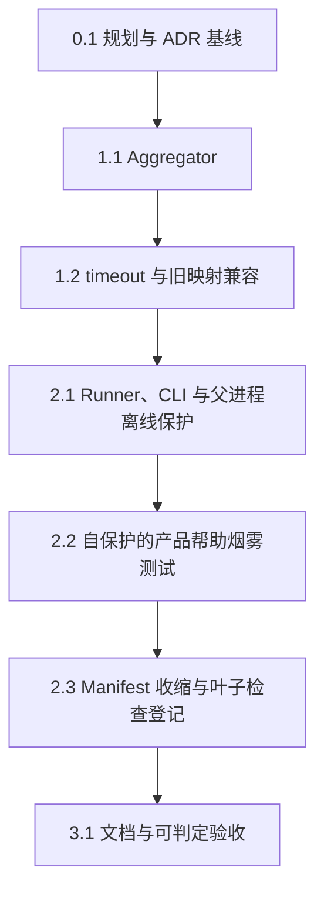

# LocalPilot P0 个人项目版实现计划

## 文档信息

| 字段 | 内容 |
| --- | --- |
| 项目 | LocalPilot |
| 阶段 | P0 — 可验证工程基线 |
| 文档类型 | Implementation Plan |
| 状态 | Replanned / 待用户确认后实施 |
| 重写日期 | 2026-07-20 |
| Requirements | [p0-verifiable-engineering-baseline-requirements.md](./p0-verifiable-engineering-baseline-requirements.md) |
| Design | [p0-verifiable-engineering-baseline-design.md](./p0-verifiable-engineering-baseline-design.md) |
| Interface Contract | [p0-verifiable-engineering-baseline-interface-contracts.md](./p0-verifiable-engineering-baseline-interface-contracts.md) |

## 1. 实现目标

本轮只完成一条个人开发需要的体检闭环：

```text
python -m p0_baseline
    -> Manifest
    -> Preflight
    -> Worker / Adapter
    -> Aggregator
    -> Human / JSON
    -> 0 / 1 / 2
```

最终能够回答三个问题：

- 当前项目可以继续开发：`success / 0`；
- 已经发现确定问题：`failure / 1`；
- 当前检查没有完整完成：`incomplete / 2`。

不实现企业级认证、完整产品行为矩阵、强沙箱、clean clone 或在线 Provider 验收。

## 2. 已完成基线

以下实现已经提交并继续复用，不进入本轮任务队列：

| 能力 | 主要文件 | 状态 |
| --- | --- | --- |
| P0 包与帮助入口 | `p0_baseline/__main__.py`, `cli.py` | 已完成骨架 |
| 环境和依赖声明 | `requirements-p0.lock`, Manifest 环境字段 | 已完成 |
| 强类型模型与错误码 | `models.py`, `errors.py` | 已完成，需小范围兼容调整 |
| 脱敏 | `redaction.py` | 已完成 |
| Manifest、Schema、HEAD 资产校验 | `manifest.py`, `manifest.json`, `schemas/**` | 已完成 |
| Preflight 与 Worker 环境净化 | `preflight.py` | 已完成 |
| Worker、Adapter、Registry | `check_worker.py`, `adapters.py`, `registry.py` | 已完成 |
| 父/子进程离线保护 | `offline.py`, `safe_subprocess.py` | 已完成 |
| skip、缺失、中断语义 | Worker 与 Adapter 测试 | 已完成 |

当前工作区中的以下文件是未完成的在途实现，必须保留：

```text
p0_baseline/aggregation.py
tests/p0/unit/test_aggregation.py
```

它们是任务 1.1 的起点，不得删除或重写成另一套方案。

## 3. 任务依赖



任务严格按顺序执行，一次只处理一个子任务。

## 4. 实现任务

### 0. 建立可提交的规划基线

- [x] 0.1 同步规划文档、ADR 和提交基线
  - _Boundary: 本计划、Requirements、Design、Interface Contract、`plan/technical-decisions.md`_
  - _Depends: 用户确认本次重规划方向_
  - _Requirements: 7.1–7.4_
  - _Design: 6.2, 8.1–8.4_
  - _Contract: IC-02, IC-05, IC-08, IC-09_
  - 同步五份技术文档对旧 Requirement 映射、活动必需检查、非递归 Manifest、父/子进程 Offline Guard 和验收门的描述。
  - 新增 Proposed ADR 取代 ADR-P0-011 的“Manifest 必须覆盖旧 56 条”结论；用户批准后再标记为 Approved，并将 ADR-P0-011 标记为 Superseded。
  - 复用 ADR-P0-008 的父进程与 Worker 双层 Offline Guard 决策，不新增平行安全机制。
  - 用户确认并授权提交后，将规划文档和对应 ADR 作为独立规划基线提交；该提交直接勾选本任务。
  - 不包含 `p0_baseline/aggregation.py`、`tests/p0/unit/test_aggregation.py` 或其他用户在途实现。
  - _完成条件：技术文档无冲突，ADR 状态正确，规划基线形成独立 commit；未完成前不得开始任务 1.1。_

### 1. 收口状态语义

- [x] 1.1 完成三态 Aggregator
  - _Boundary: `p0_baseline/aggregation.py`, `tests/p0/unit/test_aggregation.py`_
  - _Depends: 0.1_
  - _Requirements: 4.1–4.6_
  - _Design: 5.1–5.3_
  - _Contract: IC-05_
  - 从现有 OFF-by-default RED seam 和真值表测试继续。
  - 实现 `aggregate(checks, gates, determinate_failure=False)`。
  - Summary 只统计 `required=true` 的检查。
  - 确定失败优先于 incomplete；空必需检查集合不能 success。
  - 非必需检查不得改变总体状态。
  - 将 `requirement_coverage_complete` 的语义改为“当前活动 Manifest 的全部必需检查均已登记，并在本次运行中产生结构化结果”，不得继续表示旧 56 条 Requirement 全覆盖；如果兼容性允许，优先重命名为 `required_checks_complete`。
  - 增加“旧映射不完整但当前必需检查齐全”仍可 success，以及“必需检查缺少结果”必须 incomplete 的真值表。
  - 删除临时 feature flag 后重新运行测试。
  - _完成条件：现有真值表全部通过，返回稳定的 `AggregationResult` 和 0/1/2。_

- [x] 1.2 对齐 timeout 和旧 Requirement 映射语义
  - _Boundary: `p0_baseline/adapters.py`, `models.py`, `manifest.py`, `tests/p0/unit/test_check_runtime.py`, `test_models.py`, `test_manifest.py`_
  - _Depends: 1.1_
  - _Requirements: 4.4, 4.5, 7.1–7.4_
  - _Design: 6.2, 8.1_
  - _Contract: IC-04 8.4, IC-06 10.2, IC-09_
  - 先增加三个 RED 场景：Worker timeout 当前被映射为 error；缺少旧 56 条映射的合法 success 当前被模型拒绝；Manifest 完整性仍强制旧 56 条全部覆盖。
  - 将 `P0_WORKER_TIMEOUT` 转换为 `CheckStatus.INTERRUPTED` 和 incomplete 诊断。
  - Worker 退出非零、结果缺失、结果损坏仍转换为 `CheckStatus.ERROR`。
  - 保留 `requirement_ids`、`RequirementCoverage` 和旧 Manifest 数据结构。
  - 从 `BaselineReport` success 不变量中移除“必须拥有旧 56 条映射”和“旧 coverage 状态决定总体结论”的限制。
  - 修改 `manifest.py::_requirement_coverage()`：只返回 Manifest 实际存在的旧映射，不再因缺少任意旧 Requirement ID 拒绝 Manifest。
  - 继续校验旧 ID 的字段格式、唯一性、稳定顺序和 check ID 引用一致性，不允许悬空映射。
  - 重命名或重写仍声明“必须覆盖全部 56 条”的旧测试。
  - _完成条件：timeout 为 incomplete；旧 ID 仍可解析和输出，但映射不完整不再阻塞或覆盖 Aggregator 的 success。_

### 2. 贯通体检命令

- [x] 2.1 实现最小 Runner、CLI、父进程离线保护和可选文件输出
  - _Boundary: `p0_baseline/runner.py`, `cli.py`, `__main__.py`, 必要的 Schema 调整及对应测试_
  - _Depends: 1.2_
  - _Requirements: 1.1–1.4, 2.1–2.5, 3.1–3.4, 4.1–4.7, 6.1_
  - _Design: 4.1–4.3, 6.1–6.4, 8.2_
  - _Contract: IC-01, IC-06, IC-07_
  - Runner 按稳定顺序完成：Manifest 加载与完整性校验、Preflight、`not_run` 初始化、安装父进程 Offline Guard、Adapter 执行、Aggregator 聚合、报告构造和脱敏。
  - 父进程 Offline Guard 必须覆盖所有 Adapter 调用，特别是运行在父进程中的 InternalAdapter；Worker 内继续安装自己的 Offline Guard，形成两层防御。
  - 增加 InternalAdapter 尝试 DNS/socket 时被父进程阻止，以及 Guard 在成功、异常和中断后正确恢复的测试。
  - 受控 Runner 集成测试只能使用 fake Manifest/Registry 或 fixture，不得调用真实 P0 主入口或当前活动 Manifest。
  - 检查失败后继续运行其他独立检查；中断后停止启动新检查。
  - CLI 支持 `--format human|json`、`--output` 和 `--help`。
  - JSON stdout 只输出一个对象；human 最后一行输出大写状态。
  - `--output` 写出与 stdout 相同的、经模型/Schema/脱敏校验的 UTF-8 JSON。
  - 文件写入失败时增加 `EVIDENCE_INCOMPLETE` 运行诊断并返回 incomplete / 2；已有确定失败时仍保持 failure / 1。
  - 不新增独立 Evidence Sink、证据目录管理或自动清理。
  - _完成条件：受控集成测试分别演示 success/0、failure/1、incomplete/2，输出与状态一致，任何必需 Adapter 都不能在无父进程 Offline Guard 时运行。_

- [x] 2.2 新增可独立安全执行的 `runagent.py --help` 烟雾测试资产
  - _Boundary: `tests/p0/behavior/test_product_help.py` 及必要的测试包初始化文件_
  - _Depends: 2.1_
  - _Requirements: 5.1–5.4_
  - _Design: 7.1–7.2, 8.3_
  - _Contract: IC-08_
  - 测试既会被 unittest discovery 直接执行，也会被受控 Worker 执行；不得把 Worker 保护作为唯一安全前提。
  - 测试使用 `sanitized_worker_env()` 构造净化环境并临时替换 `os.environ`，同时显式进入 `offline_guard()`。
  - 将 `reload_mykeys()` 替换为“一旦调用立即失败”的桩，证明 help 路径不加载个人凭证。
  - 临时设置 `sys.argv`，通过 `runpy.run_path()` 执行当前仓库的 `runagent.py`。
  - 断言 `SystemExit(0)`、帮助文本非空、无网络访问且不需要 Provider 凭证。
  - 无论成功或异常，测试都必须恢复 `os.environ`、`sys.argv`、stdout 和 stderr。
  - 不启动第二种不受控子进程。
  - 本任务只创建并验证测试资产，暂不修改 Manifest；这样新文件可以先进入 HEAD。
  - 不修改 `runagent.py`、`agent/**`、`core/**` 或 `tools/**`。
  - _完成条件：直接 discovery 和 Worker 两条路径均通过；测试资产单独提交后进入 HEAD。_

- [ ] 2.3 收缩活动 Manifest 并只登记叶子检查
  - _Boundary: `p0_baseline/manifest.json`, 必要的 Manifest/Schema 测试_
  - _Depends: 2.2 已提交，新增测试资产已是 HEAD blob_
  - _Requirements: 1.2, 2.3, 5.1, 5.2, 7.2–7.4_
  - _Design: 3.1–3.2, 6.2_
  - _Contract: IC-02, IC-09_
  - 从活动检查中移除已延后的 `runtime.determinism`、`behavior.characterization`、`scope.compatibility`、`evidence.authoritative` 和 `documentation.consistency`，不得继续以 `required=true` 执行。
  - 如需保留旧描述符，只能放入明确不参与 Runner 执行的 legacy 兼容元数据；不得仅改成 `required=false` 后仍执行。
  - 活动 Manifest 只登记已经进入 HEAD 的叶子检查，例如 Aggregator 纯函数测试、Manifest、Preflight、Offline、Worker、Adapter 等组件测试，以及产品帮助烟雾测试。
  - Runner/CLI 集成测试、dirty 语义验证脚本以及任何调用 `python -m p0_baseline` 或当前 Runner/Manifest 的测试不得登记到 Manifest。
  - 继续使用现有 `unittest` Adapter、offline policy 和稳定检查顺序；每个活动必需 InternalAdapter 都必须存在显式注册的 callable，不得把占位描述符当作已实现能力。
  - 旧 `requirement_ids` 可继续保留为兼容元数据，不新增虚假的“新版需求已认证”声明。
  - Manifest 完整性必须验证所有新增资产是当前 HEAD blob。
  - 增加非递归约束测试：活动 Manifest 的必需测试不得重新进入当前 P0 主入口。
  - _完成条件：Manifest/Schema、资产完整性、精确 test ID discovery、InternalAdapter 注册完整性、非递归约束和完整 P0 测试通过。_

### 3. 文档和最终验收

- [ ] 3.1 更新使用说明并完成可自动判定的本地验收
  - _Boundary: `P0_BASELINE.md`, README 中的最小 P0 入口说明，外层 dirty 语义验证测试或脚本，任务内发现的必要小修复_
  - _Depends: 2.3_
  - _Requirements: 6.1–6.4_
  - _Design: 8.4, 11_
  - _Contract: IC-01, IC-07, IC-08, IC-09_
  - `P0_BASELINE.md` 说明唯一命令、支持环境、默认离线、三态、退出码、输出格式和已知限制。
  - README 只增加 P0 文档入口，不改写产品说明。
  - 文档明确全量产品行为、62 条认证、强沙箱、clean clone 和在线 Provider 均未验证。
  - 完整测试、compile check、help 和 dirty 语义验证程序必须各自退出 0。
  - dirty 语义验证程序在内部运行真实 P0，捕获并断言 `exit=2`、`overall_status=incomplete`，且唯一阻止 success 的原因是 dirty；验证程序自身必须退出 0。
  - dirty 语义验证程序属于外层验收，不得登记到 Runner 自己执行的 Manifest。
  - 裸 `python -m p0_baseline --format json` 只作为人工观察命令，不作为要求退出 0 的自动质量门。
  - 不得为得到 P0 的 0 而清理、覆盖或提交用户文件。
  - _完成条件：文档命令可复制执行；所有自动质量门退出 0；语义验证证明真实 P0 的 JSON、incomplete 状态和退出 2 一致且唯一资格阻塞为 dirty。_

## 5. 验证命令

### 5.1 每个任务至少运行

```bash
.venv/bin/python -m unittest <task-specific-test-ids>
.venv/bin/python -m compileall -q <changed-python-paths>
```

### 5.2 完整质量门

```bash
.venv/bin/python -m unittest discover -s tests/p0 -t .
.venv/bin/python -m compileall -q p0_baseline tests/p0
.venv/bin/python -m p0_baseline --help
.venv/bin/python -m unittest <dirty-semantic-verification-test>
```

上述四条自动质量门都必须退出 `0`。dirty 语义验证测试内部运行真实 P0，断言其返回 `2`、JSON 中 `overall_status` 为 `incomplete`，且唯一资格阻塞是 dirty；该测试自身退出 `0`。

以下命令只用于人工观察，不直接作为自动质量门：

```bash
.venv/bin/python -m p0_baseline --format json
```

## 6. 文件与提交规则

1. 保留当前所有用户修改和未跟踪文件，不做 `git reset --hard`、`git checkout .` 或同类回滚。
2. 一次只实现一个任务，严格执行 RED → GREEN → REFACTOR。
3. 每个任务独立复核、独立验证、独立提交。
4. 只暂存任务内文件，禁止 `git add .` 和 `git add -A`。
5. 任务 0.1 在用户确认和授权后，将规划文档与对应 ADR 作为独立规划基线提交；后续实现提交不得再次混入其他规划差异。
6. 从任务 1.1 开始，每个提交只包含本任务代码、测试以及本计划中的一个 checkbox 变化。
7. 任务 2.2 必须先提交测试资产，任务 2.3 才能让 HEAD-based Manifest 将其登记为必需资产。
8. Runner/CLI 集成测试和 dirty 语义验证程序不得进入 Runner 自己执行的 Manifest。

## 7. 停止条件

出现以下任一情况立即停止对应任务，不在 P0 中绕过：

- 需要修改 Agent、Session、Client、上下文、工具或 Provider 的用户可见语义；
- 需要恢复完整 62 条认证或全量行为测试才能继续；
- 需要运行不可信 Python/native 代码并要求强沙箱；
- 需要真实 Provider、外部网络或个人凭证；
- 需要删除、覆盖或提交用户已有修改；
- Requirements、Design 与 Interface Contract 对同一行为给出冲突结论。

## 8. 明确延后

- 上下文、模型响应、transport、重试和工具调用全量矩阵；
- hostile import、动态 Loader 和 native 强沙箱；
- 独立 Evidence Sink 与报告历史管理；
- candidate commit、clean clone 和独立验收环境；
- 重复运行比较器；
- 在线 Provider smoke；
- CI、并发和性能优化；
- Session/Client/Agent Loop 重构。

## 9. 继续门

本文件替代原 36 子任务计划和此前未与新版契约完全对齐的精简草案。已提交实现继续有效，旧计划未完成任务不再自动执行。

用户确认重规划方向并明确授权规划基线提交后，从任务 0.1 开始；任务 0.1 完成前只审阅和同步文档，不开始实现代码。
