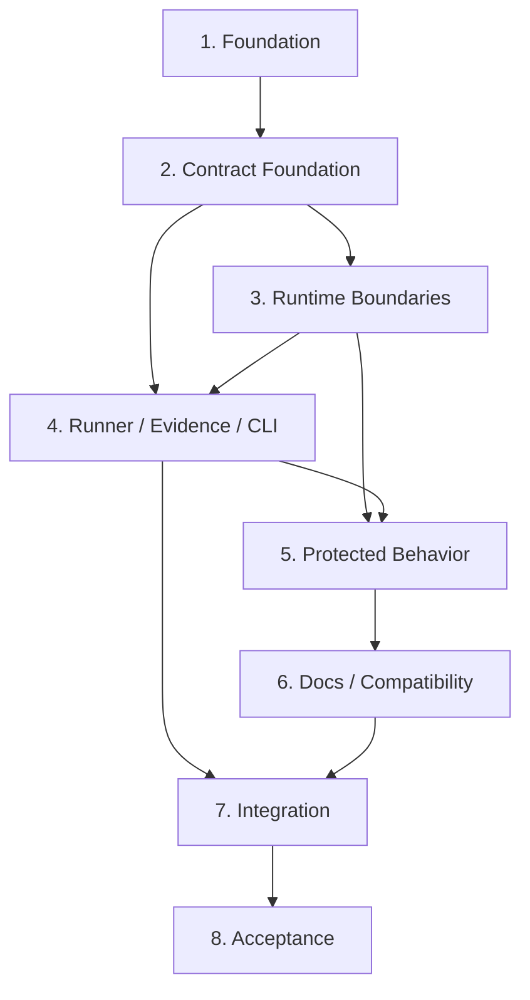

# P0 可验证工程基线实现计划

## 文档信息

| 字段 | 内容 |
| --- | --- |
| 项目 | LocalPilot |
| 阶段 | P0 — 可验证工程基线 |
| 文档类型 | Implementation Plan |
| 状态 | Plan Generated / 待用户确认 |
| Requirements | [p0-verifiable-engineering-baseline-requirements.md](./p0-verifiable-engineering-baseline-requirements.md) |
| Interface Contract | [p0-verifiable-engineering-baseline-interface-contracts.md](./p0-verifiable-engineering-baseline-interface-contracts.md) |
| Technical Design | [p0-verifiable-engineering-baseline-design.md](./p0-verifiable-engineering-baseline-design.md) |
| 任务规模 | 8 个阶段、36 个可执行子任务；每项 1–3 小时 |
| 并行模式 | 启用；可并行任务标记为 `(P)` |

## 1. 计划目标

本计划把已批准方向下的 Requirements、接口契约和 Technical Design 转换为可逐项实现、验证和审查的任务图。完成后，仓库应提供：

- 唯一命令 `python -m p0_baseline`；
- 受版本控制的 Manifest、Schema、依赖 lock、P0 测试和受控 fixture；
- 默认离线的父进程与受控 Python 子进程检查边界；
- `success/failure/incomplete` 三态及 `0/1/2` 退出码；
- 原子持久化、可追踪且脱敏的权威验收报告；
- CLI、路径、上下文、模型响应、传输错误和工具分发特征证据；
- 可在不可变 candidate revision 的干净检出中重复执行的 P0 验收。

本文件只生成计划，不授权修改生产代码、提交 Git 或清理当前工作树。

## 2. 实施前置门

开始任务 1.1 前必须满足：

1. 用户确认 Requirements、接口契约、Technical Design 和本计划可以进入实施。
2. 明确当前 `.gitignore`、`agent/agent_loop.py`、`core/context.py` 等未提交修改的归属；实施不得覆盖或回滚用户修改。
3. 不把当前 `temp/`、缓存、日志、模型原文和个人配置纳入 P0 必需资产。
4. 最终 clean-clone 验收前，用户必须提供或授权形成一个包含全部 P0 交付的不可变 candidate commit。

## 3. 已固定的实现绑定

| 决策 | 绑定 |
| --- | --- |
| 统一命令 | `python -m p0_baseline` |
| P0 包 | `p0_baseline/` |
| Manifest | `p0_baseline/manifest.json` |
| Manifest Schema | `p0_baseline/schemas/manifest.schema.json` |
| Report Schema | `p0_baseline/schemas/report.schema.json` |
| P0 必需测试 | `tests/p0/**` |
| 测试框架 | Python 标准库 `unittest` |
| 依赖复现 | `requirements-p0.lock`，精确版本与安装哈希 |
| 首版支持矩阵 | Darwin arm64 / CPython 3.12.x |
| 默认报告 | `temp/p0-baseline/<run_id>/report.json` |
| 在线 smoke | P0 首版不实现 |
| Manifest 覆盖 | 第 1–9 项共 56 条；Runner 合成 `10.1`–`10.6`；最终报告共 62 条 |

## 4. 文件结构交付

### 4.1 新建

```text
p0_baseline/
├── __init__.py
├── __main__.py
├── cli.py
├── models.py
├── errors.py
├── manifest.py
├── manifest.json
├── preflight.py
├── offline.py
├── safe_subprocess.py
├── check_worker.py
├── adapters.py
├── registry.py
├── aggregation.py
├── runner.py
├── redaction.py
├── evidence.py
└── schemas/
    ├── manifest.schema.json
    └── report.schema.json

tests/p0/
├── unit/
├── integration/
├── behavior/
└── fixtures/

requirements-p0.lock
P0_BASELINE.md
plan/p0-test-asset-classification.md
plan/p0-scope-audit.md
```

### 4.2 修改

```text
.gitignore
README.md
```

以下生产文件只有在对应特征测试证明存在 P0 范围内缺陷时才允许做最小兼容修复：

```text
config/paths.py
core/context.py
core/client.py
core/session.py
tools/base.py
```

任何需要修改 `agent/agent_loop.py`、重构 Session/Client 或改变用户可见语义的发现都必须暂停并返回范围审查。

## 5. 依赖图



主要并行波次：

- Wave 1：1.2 与 1.3；2.2 与其他 Contract 基础工作。
- Wave 2：3.2 与 3.4；4.1 在 Contract Models 完成后独立推进。
- Wave 3：5.2–5.7 在 5.1 建立 discovery 骨架后并行。
- Wave 4：6.2 可与 6.1 后半段并行，最终在 7.1 汇合。
- 8.x 为候选修订和正式验收链，串行执行。

## 6. 实现任务

### 1. 建立 P0 工程资产与运行环境基础

- [x] 1.1 创建 P0 包骨架和帮助入口
  - _Boundary: BaselineScaffolding_
  - _Depends: none_
  - _Estimate: 1–2 hours_
  - 创建 `p0_baseline/__init__.py`、`p0_baseline/__main__.py`、`p0_baseline/cli.py` 和入口单元测试。
  - 先实现不构造 Runner 的 `--help` 路径，并预留 human/json/output 参数解析边界。
  - 完成可见性：从仓库根目录和非根工作目录执行 `python -m p0_baseline --help` 均返回 `0`，且不会导入个人模型配置。
  - _Requirements: 3.1, 9.1, 9.2_

- [x] 1.2 治理 Git 忽略规则和历史测试资产
  - _Boundary: BaselineAssets_
  - _Depends: 1.1_
  - _Estimate: 2–3 hours_
  - 在保留用户现有差异的前提下修改 `.gitignore`：恢复忽略 `temp/`，只解除 `tests/p0/**` 及其父目录的必要忽略。
  - 创建 `plan/p0-test-asset-classification.md`，逐项记录本机历史测试的迁移、重写或排除决定。
  - 完成可见性：`git check-ignore` 证明 P0 测试可跟踪、`temp/` 和凭证仍被忽略，所有已发现历史测试均有明确分类。
  - _Requirements: 1.1, 1.2, 1.3, 1.5, 5.6, 10.3_

- [x] 1.3 (P) 固定首版支持矩阵
  - _Boundary: EnvironmentDeclaration_
  - _Depends: 1.1_
  - _Estimate: 1–2 hours_
  - 在 Manifest 骨架中声明 Darwin arm64 / CPython 3.12.x，并定义稳定 environment ID。
  - 明确其他 OS、架构和 Python 次版本默认不受支持，只有完成独立验证后才能加入。
  - 完成可见性：支持和不支持环境 fixture 能分别产生 `supported=true/false` 的确定预期。
  - _Requirements: 2.2, 2.3, 2.4_

- [x] 1.4 建立可复现依赖 lock 和准备验证
  - _Boundary: DependencyDeclaration_
  - _Depends: 1.3_
  - _Estimate: 2–3 hours_
  - 创建 `requirements-p0.lock`，记录完整精确版本和安装哈希；保留 `requirements.txt` 的产品声明职责。
  - 增加独立环境安装与依赖指纹测试，不把未声明手工安装作为前提。
  - 完成可见性：新环境能够使用 `--require-hashes` 安装，安装后依赖指纹与声明值一致，且不需要 pytest 或 Provider 凭证。
  - _Requirements: 2.1, 2.2, 2.5, 2.6_

### 2. 实现契约模型、脱敏和 Manifest

- [x] 2.1 实现强类型状态、报告和错误模型
  - _Boundary: ContractModels_
  - _Depends: 1.1_
  - _Estimate: 2–3 hours_
  - 创建 `p0_baseline/models.py` 和 `p0_baseline/errors.py`，定义接口契约中的枚举、数据对象、错误码及序列化边界。
  - 校验状态与退出码、Summary 计数、必需诊断和 Requirement ID 格式。
  - 完成可见性：单元测试覆盖全部合法/非法状态组合，非法对象不能被序列化为权威报告。
  - _Requirements: 3.2, 3.3, 3.4, 3.5, 8.1, 8.2, 8.5_

- [x] 2.2 (P) 实现递归脱敏器
  - _Boundary: Redaction_
  - _Depends: 2.1_
  - _Estimate: 1–2 hours_
  - 创建 `p0_baseline/redaction.py`，实现敏感字段名匹配、原值替换、大小限制和命中计数。
  - 脱敏失败时丢弃详情，不允许退回原始对象或 traceback。
  - 完成可见性：嵌套 dict/list、URL、headers 和异常详情中的测试 secret 均不会出现在序列化结果中。
  - _Requirements: 1.5, 8.6_

- [x] 2.3 实现 Manifest Loader 和两个 JSON Schema
  - _Boundary: Manifest_
  - _Depends: 1.2, 1.3, 2.1_
  - _Estimate: 2–3 hours_
  - 创建 `p0_baseline/manifest.py`、`manifest.json`、`schemas/manifest.schema.json` 和 `schemas/report.schema.json`。
  - 校验相对路径、枚举、CheckId、Adapter、精确 test ID、支持矩阵和未知字段兼容规则。
  - 完成可见性：有效 Manifest 可加载为不可变描述符；重复 ID、绝对路径、未知 Adapter 和不支持环境声明产生稳定错误码。
  - _Requirements: 1.1, 1.3, 1.4, 2.3, 5.1, 5.2, 5.5, 5.6, 8.4_

- [x] 2.4 实现受控资产、Requirement 覆盖和 Manifest 摘要校验
  - _Boundary: ManifestIntegrity_
  - _Depends: 2.3_
  - _Estimate: 1–2 hours_
  - 验证必需资产存在、可读且被当前修订跟踪；拒绝忽略文件、相邻路径和缺失资产。
  - 验证第 1–9 项的 56 条 Acceptance Criterion 均有检查映射，并生成稳定 SHA-256 摘要。
  - 完成可见性：删除任一必需 fixture、移除任一 Requirement 映射或调整 Manifest 内容都产生可复核的失败或摘要变化。
  - _Requirements: 1.1, 1.2, 1.3, 1.4, 5.1, 8.4, 10.2_

### 3. 实现 Check Runtime、Preflight 和 Offline Boundary

- [x] 3.1 实现 Check Worker、Adapter 协议和注册表
  - _Boundary: CheckRuntime_
  - _Depends: 2.1, 2.3_
  - _Estimate: 2–3 hours_
  - 创建 `check_worker.py`、`adapters.py` 和 `registry.py`，实现 `unittest` 与 `internal` 两种受控 Adapter。
  - Worker 使用精确 test ID 和自定义 RecordingTestResult，不解析自由文本日志。
  - 完成可见性：fake 检查能够返回结构化 passed/failed/error 结果，未知 Adapter 和结果 JSON 无效时产生稳定诊断。
  - _Requirements: 3.3, 3.4, 5.1, 8.1, 8.2_

- [x] 3.2 (P) 实现仓库、运行时和代码来源预检
  - _Boundary: Preflight_
  - _Depends: 2.1, 2.3_
  - _Estimate: 2–3 hours_
  - 创建 `preflight.py`，读取完整 revision、工作树状态、OS、架构、Python 版本和核心模块来源。
  - 使用本地只读 Git 命令及 `find_spec()`，不通过导入触发个人配置。
  - 完成可见性：dirty tree 得到非资格状态，错误平台和当前检出外代码来源得到确定失败诊断。
  - _Requirements: 2.3, 2.4, 5.3, 5.4, 10.3_

- [x] 3.3 实现依赖指纹和 Worker 凭证环境净化
  - _Boundary: PreflightEnvironment_
  - _Depends: 1.4, 3.2_
  - _Estimate: 2–3 hours_
  - 由 Preflight 比较规范化已安装依赖与 lock，并生成 `sanitized_worker_env`。
  - 从 Worker 环境删除代理、遥测和个人 Provider 配置变量；只记录 `personal_credentials_loaded=false`，不读取 secret 值。
  - 完成可见性：依赖漂移产生失败，注入假 API Key/Cookie/代理变量后 Worker 仍看不到原值且报告不泄露。
  - _Requirements: 2.1, 2.2, 2.5, 2.6, 4.6, 8.6, 10.3_

- [x] 3.4 (P) 实现父进程 Offline Guard
  - _Boundary: OfflineBoundary_
  - _Depends: 2.1, 2.2_
  - _Estimate: 2–3 hours_
  - 创建 `offline.py`，在发出 DNS 前拒绝外部主机，并拦截 TCP、UDP、connect、connect_ex 和 sendto。
  - 默认拒绝 loopback；只有 Manifest 显式允许的受控 fixture 可使用。
  - 完成可见性：外部 DNS/TCP/UDP 尝试均被阻断并产生脱敏的 `P0_NETWORK_POLICY_VIOLATION`。
  - _Requirements: 4.1, 4.3, 4.6_

- [x] 3.5 实现受控 Python 子进程和子进程 Offline Guard
  - _Boundary: SafeSubprocess_
  - _Depends: 2.2, 3.1, 3.3, 3.4_
  - _Estimate: 2–3 hours_
  - 创建 `safe_subprocess.py`，只允许当前 `sys.executable` 启动 Check Worker，并消费 Preflight 的净化环境。
  - Worker 在导入任何测试模块前安装 Offline Guard；任意非 Python 子进程请求被拒绝。
  - 完成可见性：子进程外网尝试被阻断，未知可执行文件不能启动，违规目标摘要不包含凭证或 query 内容。
  - _Requirements: 4.1, 4.3, 4.6, 8.6_

- [ ] 3.6 实现 skip、xfail、缺失结果和 timeout 完整性语义
  - _Boundary: CheckResultIntegrity_
  - _Depends: 3.1, 3.5_
  - _Estimate: 2–3 hours_
  - 将 skipped、expectedFailure、unexpectedSuccess、testsRun 不足、Worker timeout 和结果文件缺失转换为契约状态。
  - 为未执行的必需检查补齐 `not_run`，不允许框架把 skip 或 xfail 计为通过。
  - 完成可见性：每种场景都有确定 CheckStatus、Diagnostic 和总体非成功预期。
  - _Requirements: 3.4, 3.5, 5.1, 5.6, 10.4_

- [ ] 3.7 实现缓存、相邻代码和当前检出完整性检查
  - _Boundary: WorkspaceIntegrity_
  - _Depends: 3.2, 3.5_
  - _Estimate: 2–3 hours_
  - 使用隔离临时目录、净化 PYTHONPATH 和 `PYTHONDONTWRITEBYTECODE=1` 执行检查。
  - 构造相邻同名模块、旧 `__pycache__` 和未跟踪 fixture 的负向场景，验证其不能影响结果。
  - 完成可见性：任何当前检出外代码、缓存依赖或未提交必需资产都会产生稳定失败。
  - _Requirements: 1.4, 5.3, 5.4, 10.3_

### 4. 实现 Aggregator、Evidence、Runner 和 CLI

- [ ] 4.1 (P) 实现三态 Aggregator 和退出码真值表
  - _Boundary: Aggregation_
  - _Depends: 2.1_
  - _Estimate: 1–2 hours_
  - 创建 `aggregation.py`，实现 failure 优先、incomplete 次之、全通过才 success 的纯函数。
  - 同时计算 Summary、acceptance eligibility 和 `0/1/2` 退出码。
  - 完成可见性：覆盖单失败、多失败、skip、not_run、interrupted、dirty 和全通过组合的真值表全部通过。
  - _Requirements: 3.2, 3.3, 3.4, 3.5, 3.6, 10.1, 10.3, 10.4_

- [ ] 4.2 实现 Evidence Sink、Schema 校验和原子回读
  - _Boundary: Evidence_
  - _Depends: 2.2, 2.4, 4.1_
  - _Estimate: 2–3 hours_
  - 创建 `evidence.py`，实现报告 Schema 校验、临时写入、fsync、原子替换和发布后回读。
  - 报告持久化失败时返回 incomplete；已有确定失败仍保持 failure。
  - 完成可见性：完整报告可回读，模拟截断/权限/替换失败不会产生 success 或残留被误认为权威报告。
  - _Requirements: 1.5, 8.3, 8.4, 8.5, 8.6, 10.2, 10.6_

- [ ] 4.3 实现 Runner 编排和中断处理
  - _Boundary: BaselineRunner_
  - _Depends: 3.3, 3.5, 3.6, 3.7, 4.1, 4.2_
  - _Estimate: 2–3 hours_
  - 创建 `runner.py`，按 Manifest 稳定顺序执行预检和检查，保留全部独立结果。
  - SIGINT 后停止启动新检查，将当前检查标记 interrupted、剩余检查标记 not_run，并生成 incomplete 证据。
  - 聚合第 1–9 项的 56 条映射，并从资格门合成 `10.1`–`10.6`。
  - 完成可见性：fake registry 可演示 success/failure/incomplete 三条完整控制流及 62 条覆盖对象。
  - _Requirements: 3.1, 3.2, 3.3, 3.4, 3.5, 3.6, 8.1, 8.2, 8.4, 10.1, 10.2, 10.3, 10.4, 10.6_

- [ ] 4.4 实现 CLI 参数、human/json 输出和进程退出
  - _Boundary: BaselineCLI_
  - _Depends: 4.3_
  - _Estimate: 2–3 hours_
  - 完成 `cli.py` 和 `__main__.py` 的 human/json/output 调用路径。
  - JSON stdout 只输出单个报告对象；human 模式最后一行明确输出 SUCCESS/FAILURE/INCOMPLETE。
  - 完成可见性：端到端 fake Runner 测试证明状态与 `0/1/2` 一致，JSON 无进度或 ANSI 污染。
  - _Requirements: 3.1, 3.2, 3.4, 3.5, 8.5, 9.2, 10.1_

- [ ] 4.5 实现控制面三态集成场景
  - _Boundary: ControlPlaneIntegration_
  - _Depends: 4.4_
  - _Estimate: 2–3 hours_
  - 创建 `tests/p0/integration/test_runner_states.py` 和 `test_cli_output.py`。
  - 覆盖全通过、单/多失败、检查异常、skip、缺失结果、中断和证据写入失败。
  - 完成可见性：每个场景同时断言检查结果、总体状态、退出码、报告字段和诊断保留。
  - _Requirements: 3.2, 3.3, 3.4, 3.5, 3.6, 8.1, 8.2, 8.3, 8.5, 10.4_

### 5. 建立 P0 必需发现与产品特征证据

- [ ] 5.1 建立 P0 test discovery 骨架并完成历史分类闭环
  - _Boundary: P0TestAssets_
  - _Depends: 2.3, 3.1_
  - _Estimate: 2–3 hours_
  - 创建 `tests/p0/unit`、`integration`、`behavior` 和 `fixtures` 包结构，并实现精确 test ID discovery 自检。
  - 将 `plan/p0-test-asset-classification.md` 中每个历史测试条目绑定到迁移目标或排除理由。
  - 完成可见性：P0 discovery 无导入错误；每个本机历史测试都有唯一分类且没有被静默忽略。
  - _Requirements: 5.1, 5.2, 5.5, 5.6_

- [ ] 5.2 (P) 建立 CLI help 和核心模块加载特征测试
  - _Boundary: ProtectedCLI_
  - _Depends: 3.1, 3.3, 5.1_
  - _Estimate: 2–3 hours_
  - 创建 `tests/p0/behavior/test_cli_module_load.py`，验证 `runagent.py --help` 的当前主参数和无凭证启动。
  - 对 P0 指定核心文件执行 AST/模块来源检查，不触发真实 Provider。
  - 完成可见性：无凭证、无网络时帮助入口成功，31 个当前生产 Python 文件或最终 Manifest 指定集合完成语法检查。
  - _Requirements: 6.1, 6.2, 7.1_

- [ ] 5.3 (P) 建立非根工作目录路径锚点特征测试
  - _Boundary: ProtectedPaths_
  - _Depends: 3.1, 3.2, 5.1_
  - _Estimate: 1–2 hours_
  - 创建 `tests/p0/behavior/test_path_anchors.py`，从仓库根外调用入口并检查项目资产与运行目录来源。
  - 只在测试证明现有锚点不满足当前语义时对 `config/paths.py` 做最小修复。
  - 完成可见性：不同 cwd 下的项目自有路径均解析到 candidate checkout，不命中相邻项目。
  - _Requirements: 6.3, 7.1, 7.3_

- [ ] 5.4 (P) 建立上下文裁剪和工具结果配对特征测试
  - _Boundary: ProtectedContext_
  - _Depends: 3.1, 5.1_
  - _Estimate: 2–3 hours_
  - 创建 `tests/p0/behavior/test_context_history.py`，覆盖裁剪首消息、顺序、孤立工具结果和多工具配对。
  - 如需修改 `core/context.py`，先保留并理解用户现有未提交差异，只做兼容性修复。
  - 完成可见性：所有受控历史经裁剪/修复后仍满足发送顺序与工具 ID 配对不变量。
  - _Requirements: 6.4, 7.3_

- [ ] 5.5 (P) 建立模型响应和多工具调用受控 fixture
  - _Boundary: ProtectedModelResponse_
  - _Depends: 3.1, 3.3, 5.1_
  - _Estimate: 2–3 hours_
  - 由本任务独占维护 `tests/p0/fixtures/model_responses/**` 和 `test_model_responses.py`。
  - 覆盖纯文本、thinking、错误、单/多工具调用及 id/name/arguments 关联；文本协议 case 标记 transitional。
  - 完成可见性：所有响应类型完全离线可判定，多工具关联在归一化前后保持一致。
  - _Requirements: 4.2, 6.5, 6.6, 6.9, 7.2, 7.3_

- [ ] 5.6 (P) 建立重试、不可重试和流式中断特征测试
  - _Boundary: ProtectedTransport_
  - _Depends: 3.1, 3.3, 5.1_
  - _Estimate: 2–3 hours_
  - 由本任务独占维护 `tests/p0/fixtures/transport_events/**` 和 `test_transport_errors.py`，不修改 model response fixture。
  - 使用 fake transport/time 验证三类错误结果，不访问外部网络。
  - 完成可见性：可重试、不可重试和流中断产生不同稳定错误码与可诊断状态。
  - _Requirements: 4.2, 6.8, 7.2_

- [ ] 5.7 (P) 建立有效、坏参数和未知工具分发特征测试
  - _Boundary: ProtectedToolDispatch_
  - _Depends: 3.1, 5.1_
  - _Estimate: 1–2 hours_
  - 创建 `tests/p0/behavior/test_tool_dispatch.py`，使用本任务自有内存输入，不依赖模型或 transport fixture。
  - 覆盖有效调用、非对象参数、未知工具和可恢复执行异常。
  - 完成可见性：所有场景均产生可判定结果，任何可恢复错误都不会被解释为总体成功。
  - _Requirements: 6.7, 7.3_

### 6. 对齐文档并建立兼容性与范围门

- [ ] 6.1 更新 P0 指南和 README 一致性
  - _Boundary: Documentation_
  - _Depends: 1.4, 4.4, 5.2_
  - _Estimate: 2–3 hours_
  - 创建 `P0_BASELINE.md`，写明唯一命令、支持环境、依赖准备、默认离线、报告位置和三态语义。
  - 修正 README 中过时的 `agentmain.py`、目录图和帮助命令，区分 verified/transitional/planned。
  - 明确 P0 首版不提供在线 smoke；未来提供时不得替代离线检查。
  - 完成可见性：文档中的命令可执行，环境与 Manifest 一致，README 不再把不存在入口描述为当前能力。
  - _Requirements: 4.4, 4.5, 9.1, 9.2, 9.3, 9.4, 9.5, 9.6_

- [ ] 6.2 (P) 建立产品兼容性和范围审计
  - _Boundary: CompatibilityAndScope_
  - _Depends: 5.2, 5.3, 5.4, 5.5, 5.6, 5.7_
  - _Estimate: 2–3 hours_
  - 创建兼容性检查和 `plan/p0-scope-audit.md`，记录产品入口、参数、配置选择、上下文、工具和任务语义证据。
  - 审计 P0 差异，禁止 Session/Client 重构、新产品能力或真实 Provider 必需门。
  - 完成可见性：范围审计能列出全部 P0 变更，并在出现 Out of scope 文件或语义变化时返回 `P0_SCOPE_VIOLATION`。
  - _Requirements: 7.1, 7.2, 7.3, 7.4, 7.5, 7.6, 10.5_

### 7. 集成 Manifest、Requirement 映射和确定性

- [ ] 7.1 完成最终 Manifest、Adapter Registry 和 62 条追踪映射
  - _Boundary: ManifestIntegration_
  - _Depends: 4.5, 5.1, 5.2, 5.3, 5.4, 5.5, 5.6, 5.7, 6.1, 6.2_
  - _Estimate: 2–3 hours_
  - 将所有 P0 必需资产、精确 test ID、Adapter、超时、迁移状态和第 1–9 项的 56 条映射写入 Manifest。
  - 将 Runner 的 `10.1`–`10.6` 完成门映射加入最终 RequirementCoverage 合成表。
  - 完成可见性：Manifest 顺序稳定、资产全部可跟踪，最终报告映射正好覆盖源文档中的 62 个数字 ID。
  - _Requirements: 1.1, 5.1, 8.4, 10.1, 10.2, 10.3, 10.4, 10.5, 10.6_

- [ ] 7.2 实现去易变字段的重复运行比较器
  - _Boundary: Determinism_
  - _Depends: 4.2, 7.1_
  - _Estimate: 1–2 hours_
  - 比较时排除 run_id、时间戳、耗时和临时路径，保留 Manifest 摘要、检查顺序、状态、错误码、Requirement 映射和总体结论。
  - 创建相同输入一致、语义差异必失败的单元与集成测试。
  - 完成可见性：等价报告比较通过，任一必需检查状态或映射变化均产生明确差异。
  - _Requirements: 2.2, 3.6, 10.6_

### 8. 执行负向、干净检出和最终验收

- [ ] 8.1 执行控制面 adversarial 验收矩阵
  - _Boundary: AcceptanceNegativeMatrix_
  - _Depends: 3.5, 4.5, 7.1_
  - _Estimate: 2–3 hours_
  - 覆盖缺资产、坏 Manifest、不支持环境、外网尝试、相邻模块、多失败、skip、dirty、证据写入失败和 secret 注入。
  - 每个场景断言状态、退出码、错误码、检查保留和报告脱敏。
  - 完成可见性：所有负向场景都返回 failure 或 incomplete，且没有任何路径返回假 success。
  - _Requirements: 1.4, 2.4, 3.4, 3.5, 4.3, 5.2, 8.1, 8.2, 8.6, 10.3, 10.4_

- [ ] 8.2 验证用户授权的不可变 candidate revision
  - _Boundary: CandidateRevisionGate_
  - _Depends: 8.1_
  - _Estimate: 1 hour_
  - 不创建或提交 revision，除非用户明确授权；本任务只验证用户提供的完整 commit ID。
  - 确认全部 P0 必需资产、Design、计划和文档已纳入该 revision，且范围审计对应同一 revision。
  - 完成可见性：输出一个可复核 candidate commit ID；缺少任一必需资产时不进入 8.3。
  - _Requirements: 1.1, 1.3, 10.3, 10.5_

- [ ] 8.3 从 candidate revision 准备独立 clean clone 和锁定环境
  - _Boundary: CleanEnvironmentPreparation_
  - _Depends: 1.4, 8.2_
  - _Estimate: 2–3 hours_
  - 从不可变 commit 创建本地独立 clean clone，不复制相邻项目、缓存、个人配置或运行时输出。
  - 在 Darwin arm64 / CPython 3.12.x 环境按 lock 准备依赖，并在验收开始前确认依赖指纹。
  - 完成可见性：clone 工作树 clean、必需资产可见、个人凭证不存在、环境预检 supported。
  - _Requirements: 1.1, 2.1, 2.2, 2.3, 2.5, 2.6, 5.3, 5.4, 10.3_

- [ ] 8.4 在 clean clone 中执行两次默认离线 P0 E2E
  - _Boundary: CleanCheckoutAcceptance_
  - _Depends: 6.1, 7.2, 8.3_
  - _Estimate: 2–3 hours_
  - 两次执行 `python -m p0_baseline --format json`，不启用外网或真实 Provider。
  - 使用 7.2 比较器验证检查集合、状态、错误码、Requirement 映射和总体结论一致。
  - 完成可见性：两次退出码均为 `0`，报告均为 success/eligible，去易变字段后完全等价。
  - _Requirements: 3.1, 3.3, 3.6, 4.1, 4.6, 10.1, 10.6_

- [ ] 8.5 完成 62 条 Requirement、文档、证据和范围审计
  - _Boundary: FinalAcceptanceAudit_
  - _Depends: 8.4_
  - _Estimate: 2–3 hours_
  - 校验最终报告、Manifest、文档命令、能力状态、范围审计和 candidate revision 一致。
  - 确认第 1–9 项的 56 条检查映射通过，`10.1`–`10.6` 完成门通过，总计 62 条无缺失。
  - 完成可见性：生成最终验收摘要，明确 candidate revision、支持环境、两次报告结论和 Review Gate PASS；运行时原始报告不提交 Git。
  - _Requirements: 8.3, 8.4, 8.5, 8.6, 9.4, 9.5, 9.6, 10.1, 10.2, 10.3, 10.4, 10.5, 10.6_

## 7. Requirement 覆盖汇总

| Requirement | 主要任务 |
| --- | --- |
| 1 | 1.2, 2.2–2.4, 3.7, 4.2, 7.1, 8.1–8.3 |
| 2 | 1.3–1.4, 2.3, 3.2–3.3, 7.2, 8.1, 8.3 |
| 3 | 1.1, 2.1, 3.1, 3.6, 4.1, 4.3–4.5, 8.1, 8.4 |
| 4 | 3.3–3.5, 5.5–5.6, 6.1, 8.1, 8.4 |
| 5 | 1.2, 2.3–2.4, 3.1–3.2, 3.6–3.7, 5.1, 7.1, 8.1, 8.3 |
| 6 | 5.2–5.7 |
| 7 | 5.2–5.7, 6.2 |
| 8 | 2.1–2.2, 2.4, 3.1, 3.3, 3.5, 4.2–4.5, 7.1, 8.1, 8.5 |
| 9 | 1.1, 4.4, 6.1, 8.5 |
| 10 | 1.2, 2.4, 3.2–3.3, 3.6–3.7, 4.1–4.5, 6.2, 7.1–7.2, 8.1–8.5 |

## 8. 实施风险与停止条件

| 风险 | 处理 |
| --- | --- |
| 当前用户修改与 P0 文件重叠 | 实施前逐文件检查 diff；不覆盖、不回滚；无法无损合并时请求用户决定 |
| 历史测试错误很多 | 不全量修复；按 Design 迁移 P0 必需行为并显式分类其余测试 |
| native 扩展或任意子进程绕过离线边界 | 首版禁止加入此类必需检查；需要时返回 Design 修订 |
| 开发工作树 dirty 导致总体 incomplete | 组件测试用受控 snapshot；success 仅在用户授权的 candidate commit clean clone 中产生 |
| 特征测试要求改变用户可见语义 | 立即停止对应任务，记录失败证据并创建独立 Spec |
| 需要 Session/Client 结构化重构才能通过 | 判定 Out of scope，停止 P0 扩展 |
| 依赖 lock 无法在支持环境复现 | 不继续 Runner success 路径，回到 1.4 修复环境声明 |

## 9. Task Plan Review Gate

### 9.1 覆盖

- [x] 源 Requirements 的 62 个数字 Acceptance Criterion 全部至少映射到一个任务。
- [x] IC-01 至 IC-10 和 Design 全部组件均有实施任务。
- [x] Manifest 56 条与 Runner 合成 6 条的边界明确。
- [x] 负向、离线、干净检出、重复性、文档和范围验收均有任务。

### 9.2 可执行性

- [x] 36 个子任务均为 1–3 小时范围，并具有具体文件或可观察产出。
- [x] 所有跨边界依赖均显式标注。
- [x] 脱敏、证据持久化、Runner、CLI、fixture 所有权和完整性检查已拆分。
- [x] 不可变 candidate revision 是正式 clean-clone 验收的显式前置条件。

### 9.3 独立 sanity review

- [x] 初次审查发现未完成 Design，已先生成 Technical Design。
- [x] 第二次审查发现覆盖层次、fixture、凭证环境和验收粒度问题，已修复。
- [x] 最终审查修复 Manifest/support、timeout/child 和 Runner synthesis 依赖后返回 `PASS`。

**Task Plan Review Gate 结论：PASS。**

## 10. 批准门

本文件当前为 `Plan Generated / 待用户确认`。

获得用户明确批准后才能开始任务 1.1。即使计划获批，以下外部动作仍需各自授权：

- 创建 Git commit；
- 清理或删除当前未跟踪运行数据；
- 覆盖用户已有修改；
- 扩展 P0 Out of scope；
- 启用任何真实 Provider 在线验证。
