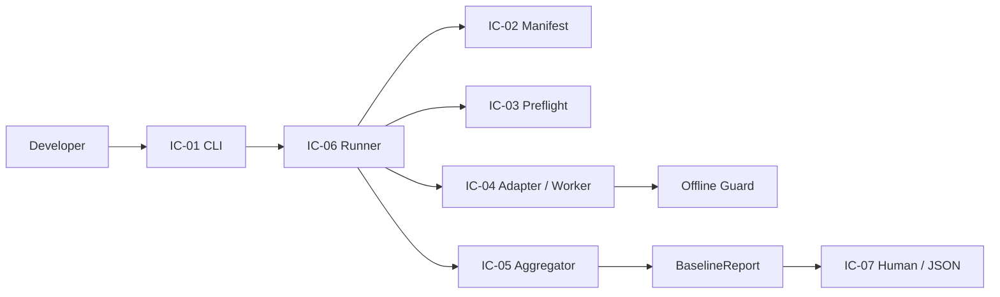

# LocalPilot P0 个人项目版接口契约

## 文档信息

| 字段 | 内容 |
| --- | --- |
| 项目 | LocalPilot |
| 阶段 | P0 — 可验证工程基线 |
| 文档类型 | Interface Contract |
| 契约版本 | `0.2.0-draft` |
| 状态 | Replanned / 待用户确认 |
| 重写日期 | 2026-07-20 |
| Requirements | [p0-verifiable-engineering-baseline-requirements.md](./p0-verifiable-engineering-baseline-requirements.md) |
| Design | [p0-verifiable-engineering-baseline-design.md](./p0-verifiable-engineering-baseline-design.md) |

## 1. 契约目标

本契约只定义个人项目版 P0 各组件之间必须保持一致的接口：

- `python -m p0_baseline` 的参数、输出和退出码；
- Manifest、Preflight、Worker、Adapter、Aggregator 和 Runner 的数据边界；
- `success / failure / incomplete` 三态规则；
- JSON 输出和敏感信息保护；
- `runagent.py --help` 最小业务烟雾检查；
- 旧版 56/62 条 Requirement 映射的兼容方式。

本契约不拥有 LocalPilot 产品运行时，不定义 Agent、Session、Client、上下文、工具或 Provider 的内部接口。

## 2. 规范性用语

- `MUST`：必须满足。
- `MUST NOT`：禁止出现。
- `SHOULD`：建议满足；不满足时应记录原因。
- `MAY`：可选行为。

## 3. 接口关系



只有 Aggregator 和 Runner 可以决定总体状态。测试框架、单个 Adapter、终端日志和产品日志都不能自行声明 P0 成功。

## 4. 公共状态与标识

### 4.1 标识格式

| 类型 | 约束 |
| --- | --- |
| `CheckId` | 小写点分标识，匹配 `^[a-z][a-z0-9]*(\.[a-z0-9][a-z0-9_-]*)+$` |
| `TestId` | 精确 dotted unittest ID |
| `Revision` | 当前 Git commit 的完整 ID |
| `RelativePath` | 仓库相对路径，不允许绝对路径和 `..` 逃逸 |
| `Timestamp` | 带时区 RFC 3339 字符串 |
| `DurationMs` | 非负整数 |
| `LegacyRequirementId` | 旧版数字 ID，例如 `3.2`；仅为兼容现有数据保留 |

### 4.2 总体状态

```text
BaselineStatus = success | failure | incomplete
```

| 状态 | 退出码 | 含义 |
| --- | --- | --- |
| `success` | `0` | 所有必需检查执行并通过，且 success 资格门满足 |
| `failure` | `1` | 存在已经确定的环境、资产、网络或检查失败 |
| `incomplete` | `2` | 没有确定失败，但检查未完整执行或 success 资格不足 |

`--help` 成功也返回 `0`，但它不代表一次 P0 `success`。

### 4.3 单项状态

```text
CheckStatus = passed | failed | error | skipped | not_run | interrupted
```

- `failed` 和 `error` 是确定失败；
- `skipped`、`not_run` 和 `interrupted` 是未完成；
- 只有 `required=true` 的检查影响总体状态；
- 非必需检查可以记录，但 MUST NOT 改变总体状态。

## 5. IC-01：CLI

### 5.1 命令

```text
python -m p0_baseline [--format human|json] [--output PATH]
python -m p0_baseline --help
```

### 5.2 参数契约

| 参数 | 默认值 | 契约 |
| --- | --- | --- |
| `--format` | `human` | 只接受 `human` 或 `json` |
| `--output` | 无 | 指定额外 JSON 输出文件 |
| `--help` | 无 | 显示帮助，不构造 Runner，不加载 Provider 配置 |

### 5.3 输出契约

- human 模式 MUST 在最后一行显示 `SUCCESS`、`FAILURE` 或 `INCOMPLETE`；
- JSON 模式 stdout MUST 只包含一个 JSON 对象；
- JSON stdout MUST NOT 混入进度文字、ANSI、Worker stdout、traceback 或模型原文；
- human 和 JSON MUST 表达同一个总体状态、退出码和检查统计；
- 无效参数使用 argparse 标准错误，不生成伪造的 `BaselineReport`。

## 6. IC-02：Manifest

### 6.1 `BaselineManifest`

现有字段继续保留：

```text
schema_version
manifest_id
required_assets: AssetDescriptor[]
checks: CheckDescriptor[]
supported_environments: EnvironmentConstraint[]
dependency_lock
dependency_fingerprint
evidence_schema_version
supported_environment_id
```

### 6.2 `AssetDescriptor`

```text
path: RelativePath
kind: test | fixture | config | documentation
required: boolean
requirement_ids: LegacyRequirementId[]
```

规则：

- `required=true` 的资产 MUST 存在于当前 `HEAD`，且 Git object type 必须为 `blob`；
- symlink、路径逃逸、忽略文件、未跟踪文件和目录不能满足必需资产；
- `requirement_ids` 暂时保留为旧版兼容元数据，不代表新版 Requirements 已通过。

### 6.3 `CheckDescriptor`

```text
check_id: CheckId
title: non-empty string
category: string
required: boolean
requirement_ids: LegacyRequirementId[]
asset_refs: RelativePath[]
network_policy: offline
timeout_ms: positive integer
migration_status: stable | transitional
adapter: unittest | internal
test_ids: TestId[]
allow_loopback: boolean
```

规则：

- `check_id` 在 Manifest 中唯一；
- `unittest` Adapter MUST 提供非空、唯一、精确的 `test_ids`；
- 未注册 Adapter、重复 ID、未知字段和非法路径 MUST 使 Manifest 校验失败；
- Manifest 顺序就是 Runner 的检查顺序；
- `checks` 是 Runner 的活动执行集合；延后能力或旧占位描述符不得以 `required=true` 留在其中；
- 活动必需 unittest MUST 是不会调用当前 P0 主入口、当前 Runner 或当前活动 Manifest 的叶子检查；
- 活动必需 InternalAdapter MUST 存在显式注册的 callable；
- 首版必需检查的 `network_policy` 固定为 `offline`。

### 6.4 `ManifestIntegrity`

```text
asset_paths: RelativePath[]
requirement_coverage: RequirementMapping[]
manifest_digest: sha256 string
```

`requirement_coverage` 只返回 Manifest 中实际存在且引用有效的旧映射，MUST NOT 要求旧 56 条 ID 全部出现；它只证明现存旧映射自身一致，不是个人项目版 P0 的完成门。`manifest_digest` MUST 使用稳定序列化计算。

## 7. IC-03：Preflight

### 7.1 调用

```text
inspect_preflight(manifest, repository_root) -> EnvironmentSnapshot
sanitized_worker_env(source_env) -> dict[str, str]
```

### 7.2 `EnvironmentSnapshot`

```text
revision
repository_root
working_tree_state: clean | dirty | unknown
runtime_name
runtime_version
os
architecture
dependency_fingerprint
code_origins: map[string, RelativePath]
network_mode: offline
personal_credentials_loaded: boolean
supported: boolean
violations: Diagnostic[]
```

### 7.3 判定规则

- 不支持的环境、依赖指纹不匹配、必需资产缺失和代码来源错误是 failure；
- dirty 工作树允许继续执行检查，但使总体至多为 incomplete；
- 代码来源 MUST 位于当前仓库，并对应当前 `HEAD` 的 blob；
- `repository_root` 写入报告时 MUST 使用 `<repository-root>` 或仓库相对表示，不暴露用户名；
- Preflight MUST NOT 读取凭证值；
- 缺少真实 Provider 凭证不是失败；
- Worker 环境只保留明确允许的运行变量，移除 Provider 凭证、Cookie、代理、遥测和私有网关配置。

## 8. IC-04：Adapter 与 Worker

### 8.1 Adapter

```text
execute(context: VerificationContext, descriptor: CheckDescriptor) -> CheckResult
```

Registry 首版只允许：

```text
unittest
internal
```

未知 Adapter MUST 产生结构化 Manifest/registry failure。

### 8.2 Worker 协议

```text
WorkerRequest {
  schema_version: "1.0.0"
  test_ids: TestId[]
}

WorkerResult {
  schema_version: "1.0.0"
  tests_run: non-negative integer
  outcomes: WorkerOutcome[]
}
```

每个请求的 `test_ids` 与结果 `outcomes.test_id` MUST 按相同顺序一一对应。数量不足、重复、未知 ID、非法 JSON 或结果文件缺失 MUST 转换为非成功结果。

### 8.3 `WorkerOutcome`

```text
status = passed | failed | error | skipped | expected_failure | unexpected_success
```

- `expected_failure` 和 `skipped` 转换为 `CheckStatus.skipped`；
- `unexpected_success` 转换为 `CheckStatus.error`；
- 网络策略违规转换为 `CheckStatus.failed`；
- Worker 不得序列化 assertion 原文、traceback 或敏感环境变量。

### 8.4 安全边界

- Safe Subprocess 只能启动当前 `sys.executable`；
- Worker 使用独立临时请求/结果文件；
- Worker 环境必须等于 Preflight 允许的净化环境；
- Runner MUST 在父进程执行任何 Adapter 前安装 Offline Guard，并在全部 Adapter 调用结束或异常退出后恢复；
- Offline Guard MUST 在测试模块导入前安装；
- 外部 DNS、TCP 和 UDP 尝试 MUST 被阻止并产生安全目标摘要；
- Worker timeout MUST 转换为 `CheckStatus.interrupted` 和未完成诊断；
- Worker 退出非零、结果缺失或结果损坏 MUST 转换为 `CheckStatus.error`。

### 8.5 `CheckResult`

现有字段继续保留：

```text
check_id
title
required
requirement_ids
status
started_at
finished_at
duration_ms
target
diagnostics: Diagnostic[]
evidence_refs: string[]
observed: object | null
```

失败、错误、跳过、未运行和中断结果 MUST 至少包含一个 `Diagnostic`。Adapter MUST NOT 决定总体状态或退出码。

## 9. IC-05：Aggregator

### 9.1 调用

```text
aggregate(
  checks: CheckResult[],
  gates: AcceptanceGates,
  determinate_failure: boolean = false
) -> AggregationResult
```

### 9.2 `AcceptanceGates`

保留当前字段：

```text
clean_checkout
offline
evidence_complete
requirement_coverage_complete
supported_environment
credentials_absent
scope_compliant
```

其中 `requirement_coverage_complete` 在个人项目版表示“当前活动 Manifest 的全部必需检查均已登记，并在本次运行中产生结构化结果”，MUST NOT 表示旧 56/62 条认证全部通过。若后续兼容版本允许改名，SHOULD 使用 `required_checks_complete`。

### 9.3 `AggregationResult`

```text
overall_status: BaselineStatus
summary: ResultSummary
acceptance_eligible: boolean
exit_code: 0 | 1 | 2
```

### 9.4 聚合规则

```text
存在 required failed/error 或 determinate_failure
    -> failure / 1
否则存在 required skipped/not_run/interrupted 或任一 gate=false
    -> incomplete / 2
否则 required checks 非空且全部 passed
    -> success / 0
```

failure 与 incomplete 同时存在时，failure 优先。Aggregator MUST 是纯函数，不读取文件、环境或时钟；Summary MUST 从 required checks 计算。

## 10. IC-06：Runner 与 BaselineReport

### 10.1 Runner 契约

```text
run(repository_root, manifest_path) -> BaselineReport
```

Runner MUST：

1. 加载并校验 Manifest；
2. 执行 Preflight；
3. 按 Manifest 顺序为必需检查建立 `not_run` 初始结果；
4. 安装父进程 Offline Guard；
5. 在 Guard 内通过 Registry 执行检查，Worker 内继续安装自己的 Guard；
6. 保留每个已经执行的独立结果；
7. 中断后停止启动新检查，剩余结果保持 `not_run`；
8. 调用 Aggregator 得出唯一总体状态；
9. 构造并脱敏 `BaselineReport`。

Runner MUST NOT 安装依赖、修改受版本控制文件、自动提交或调用真实 Provider。

### 10.2 `BaselineReport`

现有必需字段继续保留：

```text
schema_version
run_id
revision
manifest_digest
started_at
finished_at
duration_ms
mode: offline
environment: EnvironmentSnapshot
overall_status: BaselineStatus
exit_code
acceptance_eligible
summary: ResultSummary
checks: CheckResult[]
requirement_coverage: RequirementCoverage[]
run_diagnostics: Diagnostic[]
redaction
```

不变量：

- `exit_code` MUST 与 `overall_status` 一致；
- `summary` MUST 等于 required checks 的实际计数；
- `checks` 的 `check_id` MUST 唯一；
- environment revision MUST 等于 report revision；
- `acceptance_eligible=true` 仅允许出现在 success；
- success MUST 要求非空 required checks 全部 passed、环境 supported、offline、无凭证且工作树 clean；
- success MUST NOT 再要求旧版 56 条 `requirement_coverage` 全部存在；
- `requirement_coverage` 字段保留，可为空或携带旧版兼容映射；其状态不覆盖 Aggregator 结论。

### 10.3 `ResultSummary`

```text
required_total
passed
failed
error
skipped
not_run
interrupted
```

所有值为非负整数，状态计数之和 MUST 等于 `required_total`。

## 11. IC-07：输出、文件与脱敏

### 11.1 JSON

- JSON 来源 MUST 是 `BaselineReport.to_dict()`；
- 输出前 MUST 完成模型校验、Schema 校验和递归脱敏；
- JSON MUST 使用 UTF-8；
- 相同对象的 key 顺序 SHOULD 稳定；
- stdout JSON 和 `--output` 文件 MUST 表达相同对象。

### 11.2 文件输出

- `--output` 是可选副作用；
- 父目录或文件写入失败 MUST 产生运行级诊断；
- 仅文件输出失败且没有其他 failure 时，总体为 incomplete / 2；
- 已有确定 failure 时，文件失败不能把总体改成 incomplete；
- 首版不承诺 evidence 目录、fsync、发布回读、历史管理或自动清理。

### 11.3 `Diagnostic`

```text
code
message
failure_type
target
recoverable
details: object | null
```

message 和 details MUST 是脱敏、安全、有限大小的内容。未知普通异常归一化为稳定错误码，不直接输出 traceback。

### 11.4 禁止输出

任何 human、JSON、文件或 Diagnostic MUST NOT 包含：

- API Key、Token、Cookie、Authorization、Password、Secret 原值；
- 私有网关凭证、代理凭证或个人配置内容；
- 完整 prompt、模型原文回复或完整工具结果；
- 未脱敏 URL query、headers、请求正文或 traceback。

脱敏失败时 MUST 整体替换不安全值，不能回退为原文。

## 12. IC-08：最小产品烟雾检查

唯一必需产品行为检查为：

```text
runagent.py --help
```

契约：

- 作为精确 unittest ID 注册到 Manifest；
- 测试自身 MUST 使用 `sanitized_worker_env()` 临时替换环境、显式进入 `offline_guard()`，并禁止 `reload_mykeys()` 被调用；
- 测试 MUST 在 unittest discovery 直接执行和 Worker 执行两条路径中都安全；Worker 的环境净化和 Offline Guard 是第二层防御；
- 使用当前仓库 `runagent.py`，并由 Preflight/HEAD 校验证明代码来源；
- 允许通过 `runpy.run_path()` 在 Worker 进程内执行；
- 必须观察退出码 `0` 和非空帮助文本；
- 不允许真实网络和 Provider 凭证；
- 无论成功或异常，MUST 恢复 `os.environ`、`sys.argv`、stdout 和 stderr；
- 不要求验证对话、任务、模型响应、重试、上下文或工具调用；
- 检查失败先报告，不得自动修改产品语义。

## 13. IC-09：旧映射与版本兼容

### 13.1 旧 56/62 映射

- `requirement_ids`、`RequirementMapping` 和 `RequirementCoverage` 字段继续存在；
- 旧数字 ID MAY 继续出现在 Manifest 和历史报告中；
- ManifestIntegrity MUST 只返回实际存在的旧映射，并校验其格式、唯一性、稳定顺序和 check ID 引用；
- 缺少任意旧数字 ID MUST NOT 使 Manifest 非法或阻止 success；
- 旧映射只表示历史兼容关系，MUST NOT 被描述为新版 Requirements 的通过证明；
- 个人项目版 P0 success MUST 由必需检查和 AcceptanceGates 决定；
- 不得仅因旧 Requirement 移出当前范围而删除仍被检查使用的代码或测试。

### 13.2 Schema 兼容

- `schema_version` 使用语义化版本；
- 新增可选字段属于兼容变更；
- 删除或改名必需字段、改变状态枚举或退出码属于破坏性变更；
- 同一主版本消费者 SHOULD 忽略未知可选字段；
- 本轮优先调整字段语义和校验规则，不新增一套平行报告格式。

## 14. 错误影响表

| 场景 | 默认总体影响 |
| --- | --- |
| Manifest 非法、必需资产缺失 | failure |
| 环境不支持、依赖不匹配、代码来源错误 | failure |
| 网络策略违规 | failure |
| Check failed/error | failure |
| Check skipped/not_run/interrupted | incomplete |
| dirty 工作树 | incomplete |
| Worker timeout | incomplete |
| Worker 退出非零、结果缺失或损坏 | failure |
| 指定输出文件写入失败 | incomplete；已有 failure 时保持 failure |
| 缺少 Provider 凭证 | 不影响；默认验收不需要凭证 |

具体错误码继续复用 `p0_baseline/errors.py`，不在本契约中建立第二套错误枚举。

## 15. 契约验收

实现满足以下条件即可通过接口契约验收：

- CLI 参数、输出和退出码符合 IC-01；
- Manifest、Preflight、Worker 和 Adapter 的现有测试继续通过；
- Aggregator 真值表覆盖 success/failure/incomplete；
- Runner 能演示三条完整控制流并保留独立结果；
- JSON 输出经过校验和脱敏；
- `runagent.py --help` 在无凭证、无外网时通过；
- 活动 Manifest 只包含叶子检查，不会递归进入 P0 主入口；
- 外层 dirty 语义验证程序自身退出 `0`，同时断言真实 P0 返回 incomplete / `2` 且唯一资格阻塞为 dirty；
- 旧 56/62 映射不再阻塞新版 success，也未被破坏性删除；
- 未修改 LocalPilot 用户可见业务语义。

本文件替代旧版企业级 Interface Contract。用户确认后，后续实现以本契约为准。
