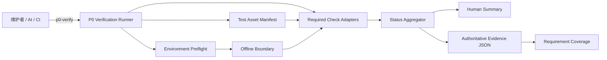

# P0 可验证工程基线接口契约

## 文档信息

| 字段 | 内容 |
| --- | --- |
| 项目 | LocalPilot |
| 阶段 | P0 — 可验证工程基线 |
| 文档类型 | Interface Contract |
| 契约版本 | `0.1.0-draft` |
| 状态 | Contract Generated / 待用户确认 |
| 上游需求 | [p0-verifiable-engineering-baseline-requirements.md](./p0-verifiable-engineering-baseline-requirements.md) |
| 语言 | 中文 |

本文档将 P0 Requirements 转换为可实现、可测试的接口边界。它定义调用方式、数据形状、状态聚合、错误语义、证据格式与兼容性规则，不规定测试框架、依赖管理器、CI 提供方或内部类结构。

## 1. 规范性用语

- `MUST`：实现必须满足，否则不符合本契约。
- `MUST NOT`：实现禁止出现该行为。
- `SHOULD`：建议满足；不满足时必须记录理由和影响。
- `MAY`：可选能力。
- 文中的 Requirement ID 均引用上游需求文档，例如 `3.2`。

## 2. 契约边界

### 2.1 本契约拥有

- P0 验收的逻辑命令、输入选项、标准输出和进程退出语义。
- 必需资产、必需检查和 Requirement 映射的数据契约。
- 环境预检、干净检出判定和当前代码来源判定。
- 默认离线模式和可选在线烟雾验证的隔离规则。
- 单项检查结果、总体状态和失败诊断的数据契约。
- 权威验收证据的格式、持久化和脱敏规则。
- P0 保护行为的受控输入与可观察结果边界。
- 契约版本演进和下游重新验证触发条件。

### 2.2 本契约不拥有

- 现有 Agent 产品 CLI 的会话、task、reflect、scheduler 或后台运行语义。
- Session、Client、Provider、Agent Loop、Tool Runtime、Memory 或 Observability 的内部重构。
- 测试框架、构建工具、依赖管理器或 CI 平台选择。
- Provider 真实网络调用的正确性或可用性。
- 后续阶段计划删除的文本工具协议的长期兼容性。
- P0 范围之外的产品缺陷修复。

### 2.3 依赖规则

P0 验收控制面 MAY 读取当前仓库、调用受版本控制的检查资产并写入运行时证据目录。它 MUST NOT：

- 把现有 Agent 任务日志作为权威验收结论；
- 在默认模式加载个人模型配置或真实 Provider 凭证；
- 修改受版本控制的项目文件以使检查通过；
- 依赖相邻项目、未提交验收资产、旧缓存或预先存在的编译产物；
- 改变 `runagent.py` 的现有产品工作流以承载 P0 状态语义。

### 2.4 需要重新验证本契约的变更

以下变更 MUST 重新审查本契约及其 Requirement 映射：

- 总体状态、单项状态或进程退出码发生变化；
- 权威证据的必需字段被删除、改名或改变语义；
- 默认网络策略由离线改为允许外网；
- 必需检查集合或其 Requirement 映射发生变化；
- 受保护产品入口或用户可见工作流发生变化；
- 证据脱敏边界发生变化；
- 上游 Requirements 被修订。

## 3. 接口关系



P0 Verification Runner 是唯一拥有总体状态和退出码的组件。任何测试框架、脚本或现有运行时日志都只能提供单项结果或补充诊断，不能自行声明 P0 完成。

## 4. 公共类型与状态代数

### 4.1 标识符和基础格式

| 类型 | 格式与约束 |
| --- | --- |
| `RequirementId` | 上游已存在的数字 ID，例如 `1.1`、`10.6`；MUST NOT 自创需求 ID |
| `CheckId` | 稳定、小写、点分标识，例如 `assets.complete`；匹配 `^[a-z][a-z0-9]*(\.[a-z0-9][a-z0-9_-]*)+$` |
| `RunId` | 单次验收唯一、不可包含凭证或用户名 |
| `Revision` | 当前仓库可判定的修订标识；Git 仓库使用完整提交 ID |
| `Timestamp` | 带时区的 RFC 3339 字符串 |
| `DurationMs` | 非负整数 |
| `RelativePath` | 相对仓库根目录，不允许绝对路径或 `..` 逃逸 |
| `SchemaVersion` | 语义化版本字符串 |

### 4.2 总体状态

```text
BaselineStatus = "success" | "failure" | "incomplete"
```

三种状态互斥：

| 状态 | 含义 |
| --- | --- |
| `success` | 全部必需检查已执行且通过；证据完整；环境、离线和干净检出门均满足 |
| `failure` | 存在确定失败，例如资产缺失、环境不支持、发现失败、断言失败、检查无法启动或网络违规 |
| `incomplete` | 没有确定失败，但存在跳过、未执行、中断、缺失结果、预期失败标记或证据未完整持久化 |

### 4.3 单项检查状态

```text
CheckStatus = "passed" | "failed" | "error" | "skipped" | "not_run" | "interrupted"
```

| 单项状态 | 总体影响 |
| --- | --- |
| `passed` | 不降低总体状态 |
| `failed` | `failure` |
| `error` | `failure` |
| `skipped` | 至少为 `incomplete` |
| `not_run` | 至少为 `incomplete` |
| `interrupted` | 至少为 `incomplete` |

### 4.4 聚合顺序

Runner MUST 按以下优先级确定唯一总体状态：

1. 如果预检、资产、网络、检查执行或断言存在确定失败，总体为 `failure`。
2. 否则，如果任一必需结果为 `skipped`、`not_run`、`interrupted`，任一结果缺失，或权威证据不完整，总体为 `incomplete`。
3. 否则，仅当全部必需检查均为 `passed` 时，总体为 `success`。

当 `failure` 和不完整条件同时存在时，`failure` 优先；报告仍 MUST 保留全部已观察到的不完整条件。

## 5. IC-01：P0 Verification Runner

### 5.1 逻辑命令

本契约使用 `p0-verify` 表示统一的逻辑命令。实现 MUST 在仓库文档中将它绑定到且仅绑定到一个可从仓库根目录执行的具体命令。具体脚本或模块路径由后续 Design 决定，不得存在两个具有不同必需检查集合的“主验收入口”。

### 5.2 调用契约

| 调用 | 行为 |
| --- | --- |
| `p0-verify` | 执行完整的默认离线 P0 必需检查，输出人类摘要并持久化 JSON 证据 |
| `p0-verify --format human` | 与默认行为相同 |
| `p0-verify --format json` | 标准输出只包含一个符合 IC-07 的 JSON 对象 |
| `p0-verify --output <path>` | 将权威 JSON 证据写到指定运行时路径 |
| `p0-verify --help` | 显示参数说明；不构成一次 P0 验收，不生成总体结论 |

规则：

- 默认模式 MUST 是 `offline`。
- P0 主验收调用 MUST 执行完整必需检查集合，MUST NOT 提供把子集伪装成总体成功的过滤参数。
- JSON 模式的标准输出 MUST NOT 混入进度文本、ANSI 控制符或子进程原始输出。
- 人类模式的最后一条摘要 MUST 明确显示 `SUCCESS`、`FAILURE` 或 `INCOMPLETE`。
- 子检查输出 SHOULD 被捕获并归入对应 `CheckResult`，而不是破坏顶层输出契约。
- 正常退出前 MUST 尝试原子写入权威证据。
- 强制终止导致没有完整报告时，任何调用方 MUST 将其解释为 `incomplete`，不得根据残留日志推断成功。

### 5.3 退出码

| 退出码 | 验收状态 |
| --- | --- |
| `0` | `success` |
| `1` | `failure` |
| `2` | `incomplete` |

`--help` 成功返回 `0`，但不携带 `BaselineStatus`。无效参数 MUST 返回非零，且不得生成成功证据。

### 5.4 副作用

Runner MUST NOT 修改受版本控制文件。允许的副作用仅包括：

- 在声明的运行时目录创建本次验收证据和隔离临时文件；
- 清理由本次运行创建的临时文件；
- 输出人类或机器可读摘要。

默认权威证据位置为：

```text
temp/p0-baseline/<run_id>/report.json
```

该目录属于运行时资产，MUST NOT 成为干净检出所需的版本控制资产。

## 6. IC-02：Test Asset Manifest

### 6.1 目的

Test Asset Manifest 是 P0 必需资产和必需检查的版本化单一事实来源。其序列化格式和具体仓库路径由后续 Design 绑定，但数据模型和不变量受本契约约束。

### 6.2 `BaselineManifest`

| 字段 | 类型 | 必需 | 契约 |
| --- | --- | --- | --- |
| `schema_version` | `SchemaVersion` | 是 | Manifest 数据模型版本 |
| `manifest_id` | string | 是 | 固定为 `localpilot.p0-baseline` |
| `required_assets` | `AssetDescriptor[]` | 是 | 至少包含测试、受控输入、环境说明和验收说明 |
| `checks` | `CheckDescriptor[]` | 是 | P0 完整必需检查集合 |
| `supported_environments` | `EnvironmentConstraint[]` | 是 | 至少声明运行时约束；OS 未限制时也需显式声明 |
| `evidence_schema_version` | `SchemaVersion` | 是 | 期望的 IC-07 版本 |

### 6.3 `AssetDescriptor`

| 字段 | 类型 | 必需 | 契约 |
| --- | --- | --- | --- |
| `path` | `RelativePath` | 是 | 资产在当前修订中的仓库相对路径 |
| `kind` | enum | 是 | `test`、`fixture`、`config`、`documentation` 之一 |
| `required` | boolean | 是 | P0 资产必须为 `true` |
| `requirement_ids` | `RequirementId[]` | 是 | 至少一个上游验收条件 |

每个必需资产 MUST 存在、可读、被当前修订跟踪，且不得由忽略文件、相邻仓库或运行时缓存补足。

### 6.4 `CheckDescriptor`

| 字段 | 类型 | 必需 | 契约 |
| --- | --- | --- | --- |
| `check_id` | `CheckId` | 是 | 在 Manifest 中唯一且跨修订保持稳定 |
| `title` | string | 是 | 非空人类可读名称 |
| `category` | enum | 是 | `asset`、`environment`、`discovery`、`behavior`、`documentation`、`scope` 之一 |
| `required` | boolean | 是 | P0 必需检查必须为 `true` |
| `requirement_ids` | `RequirementId[]` | 是 | 至少一个数字 Requirement ID |
| `asset_refs` | `RelativePath[]` | 是 | 执行检查所需的受控资产，可为空数组 |
| `network_policy` | enum | 是 | 必需检查固定为 `offline` |
| `timeout_ms` | integer | 是 | 正整数；超时产生 `error`，不得静默跳过 |
| `migration_status` | enum | 是 | `stable` 或 `transitional` |

不变量：

- 必需检查不得带有“预期失败即通过”的语义。
- `transitional` 只标识迁移期证据，不改变检查是否必须执行。
- Manifest 中的每个 `RequirementId` MUST 存在于上游需求文档。
- 第 1 至第 9 项 Requirement 的每条 Acceptance Criterion MUST 至少被一个必需检查覆盖。
- Manifest 解析失败、重复 `check_id`、未知 Requirement ID 或缺失资产均为 `failure`。

## 7. IC-03：Environment Preflight

### 7.1 操作

```text
preflight(manifest, repository) -> PreflightResult
```

预检 MUST 在任何必需行为检查之前完成。

### 7.2 `EnvironmentSnapshot`

| 字段 | 类型 | 必需 | 说明 |
| --- | --- | --- | --- |
| `revision` | `Revision` | 是 | 当前检出修订 |
| `repository_root` | string | 是 | 证据中 SHOULD 归一化，避免暴露用户名 |
| `working_tree_state` | enum | 是 | `clean`、`dirty` 或 `unknown` |
| `runtime_name` | string | 是 | 运行时名称 |
| `runtime_version` | string | 是 | 完整版本 |
| `os` | string | 是 | 操作系统标识 |
| `architecture` | string | 是 | 处理器架构 |
| `dependency_fingerprint` | string | 是 | 可比较的依赖集合摘要，不包含凭证 |
| `code_origins` | map | 是 | P0 核心加载目标到仓库相对来源的映射 |
| `network_mode` | enum | 是 | 默认 `offline` |
| `personal_credentials_loaded` | boolean | 是 | 默认验收必须为 `false` |
| `supported` | boolean | 是 | 是否满足 Manifest 环境约束 |
| `violations` | `Diagnostic[]` | 是 | 可为空数组 |

### 7.3 判定规则

- 不满足受支持环境约束时，预检 MUST 返回 `P0_ENV_UNSUPPORTED`，总体为 `failure`，并且行为检查保持 `not_run`。
- 依赖集合不能由仓库声明重建时，预检 MUST 返回 `P0_DEPENDENCY_UNDECLARED`。
- 核心代码来源不在当前检出时，预检 MUST 返回 `P0_CODE_ORIGIN_MISMATCH`。
- 官方 P0 成功证据要求 `working_tree_state=clean`；否则总体至多为 `incomplete`。
- 预检 MUST NOT 读取或输出个人凭证的值。
- 缺少真实 Provider 凭证不得成为预检失败原因。

## 8. IC-04：Offline Boundary

### 8.1 默认策略

`offline` 模式 MUST 在必需检查开始前生效，并覆盖验收进程及其子进程。它 MUST 阻止：

- 对外部地址的 TCP、UDP 和 HTTP(S) 访问；
- 外部 DNS 解析；
- 真实模型 Provider 调用；
- 遥测、追踪或数据集下载；
- 通过个人代理或私有网关绕过限制。

受控测试 MAY 使用进程内 fake transport；只有 Manifest 明确声明的本机 loopback fixture MAY 使用回环网络，并且不得路由到外部地址。

### 8.2 违规结果

任何外部网络尝试 MUST：

1. 被阻断；
2. 使对应检查状态成为 `failed`；
3. 产生 `P0_NETWORK_POLICY_VIOLATION`；
4. 记录发起检查、目标主机摘要和调用来源；
5. 不记录 Authorization、Cookie、query secret 或请求正文。

### 8.3 可选在线烟雾验证

如果后续提供在线烟雾验证：

- MUST 由验收者显式选择；
- MUST 标记为 `supplemental=true`；
- MUST 与默认离线证据分区记录；
- MUST NOT 替代、跳过或改变离线必需检查的结果；
- MUST NOT 成为 P0 `success` 的必要条件。

## 9. IC-05：Required Check Adapter

### 9.1 语言无关接口

```text
execute(context: VerificationContext, descriptor: CheckDescriptor) -> CheckResult
```

`VerificationContext` 只提供当前仓库只读视图、本次隔离运行目录、受控输入、环境快照和网络策略。检查不得从全局本机状态隐式获取必需输入。

### 9.2 `CheckResult`

| 字段 | 类型 | 必需 | 契约 |
| --- | --- | --- | --- |
| `check_id` | `CheckId` | 是 | 与 Manifest 完全一致 |
| `title` | string | 是 | 非空名称 |
| `required` | boolean | 是 | 与 Manifest 一致 |
| `requirement_ids` | `RequirementId[]` | 是 | 与 Manifest 一致 |
| `status` | `CheckStatus` | 是 | 单项终态 |
| `started_at` | `Timestamp` | 是 | 检查开始时间 |
| `finished_at` | `Timestamp` | 是 | 检查结束时间 |
| `duration_ms` | `DurationMs` | 是 | 非负 |
| `target` | string | 是 | 被检查目标的仓库相对标识或逻辑名称 |
| `diagnostics` | `Diagnostic[]` | 是 | 可为空；失败或错误时不得为空 |
| `evidence_refs` | string[] | 是 | 指向本次运行证据目录内的补充证据，可为空 |
| `observed` | object | 否 | 经过脱敏和大小限制的可观察结果 |

### 9.3 执行规则

- 断言不满足返回 `failed`。
- 检查无法启动、未捕获异常、超时或收集失败返回 `error`。
- Runner MUST 将 Adapter 抛出的普通异常转换为结构化 `error`，不得丢失其他检查结果。
- 用户可处理中断返回 `interrupted`；无法生成全部结果时总体为 `incomplete`。
- 必需检查被框架标记为 skip 或 expected-failure 时，Runner MUST 显式记录，不能将其计为 `passed`。
- 每个 Adapter MUST 在等价环境和等价受控输入下产生相同的状态与语义结果；时间戳和耗时不参与确定性比较。
- Adapter MUST NOT 直接决定总体状态或进程退出码。

## 10. IC-06：Protected Behavior Fixture

### 10.1 `BehaviorCase`

| 字段 | 类型 | 必需 | 契约 |
| --- | --- | --- | --- |
| `case_id` | string | 是 | 稳定唯一标识 |
| `category` | enum | 是 | 下表所列行为类别之一 |
| `input_ref` | `RelativePath` | 是 | 受版本控制的输入或 fixture |
| `expected_observables` | object | 是 | 只描述外部可观察不变量 |
| `requirement_ids` | `RequirementId[]` | 是 | 对应 `6.1` 至 `6.9` 及兼容性条件 |
| `migration_status` | enum | 是 | `stable` 或 `transitional` |

### 10.2 最小行为类别

| 类别 | 必须观察的契约结果 |
| --- | --- |
| `cli.help` | `runagent.py --help` 在无凭证、无外网时成功；包含当前主参数 `--task`、`--reflect`、`--input`、`--llm_no`、`--verbose`、`--bg` |
| `module.load` | 指定核心代码完成语法检查和模块加载，不调用真实 Provider |
| `path.anchor` | 项目自有资产和运行时目录锚定当前检出，而不是调用者工作目录或相邻项目 |
| `context.history` | 裁剪后首条可发送消息有效，消息顺序有效，工具调用与工具结果保持配对 |
| `model.response` | 纯文本、thinking、结构化工具调用和错误结果可区分 |
| `model.multi_tool` | 每个工具调用的名称、参数和调用 ID 保持关联 |
| `tool.dispatch` | 有效请求、错误参数和未知工具均产生可判定结果；可恢复错误不等于总体成功 |
| `model.transport_error` | 可重试错误、不可重试错误和流式中断产生不同的结构化诊断 |

规则：

- fixture MUST 使用受控输入，不允许真实 Provider 响应成为断言输入。
- `expected_observables` MUST 描述结果类别和不变量，不冻结私有类名、函数名或文本协议解析算法。
- 文本工具协议相关 case MUST 标记为 `transitional`，不得作为长期接口承诺。

## 11. IC-07：Authoritative Acceptance Evidence

### 11.1 权威性

每次 P0 验收 MUST 生成一个 `BaselineReport`。现有 `temp/logs/agent-*.jsonl`、终端文本和模型原文日志只能作为补充诊断，不能替代 `BaselineReport`。

### 11.2 `BaselineReport`

| 字段 | 类型 | 必需 | 契约 |
| --- | --- | --- | --- |
| `schema_version` | `SchemaVersion` | 是 | 初始批准版本目标为 `1.0.0` |
| `run_id` | `RunId` | 是 | 本次验收唯一 |
| `revision` | `Revision` | 是 | 与预检一致 |
| `manifest_digest` | string | 是 | Manifest 内容摘要 |
| `started_at` | `Timestamp` | 是 | 本次验收开始时间 |
| `finished_at` | `Timestamp` | 是 | 本次验收结束时间 |
| `duration_ms` | `DurationMs` | 是 | 总耗时 |
| `mode` | enum | 是 | 默认 `offline` |
| `environment` | `EnvironmentSnapshot` | 是 | IC-03 快照 |
| `overall_status` | `BaselineStatus` | 是 | IC-01 最终状态 |
| `exit_code` | integer | 是 | 与 `overall_status` 一致 |
| `acceptance_eligible` | boolean | 是 | 是否满足干净、离线、完整和可追踪门 |
| `summary` | `ResultSummary` | 是 | 结果计数 |
| `checks` | `CheckResult[]` | 是 | 与 Manifest 必需检查一一对应 |
| `requirement_coverage` | `RequirementCoverage[]` | 是 | Requirement 到检查与证据的映射 |
| `run_diagnostics` | `Diagnostic[]` | 是 | 运行级诊断，可为空 |
| `redaction` | object | 是 | 脱敏是否启用及命中数量，不包含原值 |

### 11.3 `ResultSummary`

```text
required_total
passed
failed
error
skipped
not_run
interrupted
```

所有字段均为非负整数，且分类计数总和 MUST 等于 `required_total`。

### 11.4 `RequirementCoverage`

| 字段 | 类型 | 必需 | 契约 |
| --- | --- | --- | --- |
| `requirement_id` | `RequirementId` | 是 | 上游数字 ID |
| `status` | enum | 是 | `passed`、`failed` 或 `incomplete` |
| `check_ids` | `CheckId[]` | 是 | 至少一个检查 |
| `evidence_refs` | string[] | 是 | 至少一个可复核证据引用 |

总体 `success` 时，第 1 至第 9 项 Requirement 的每条 Acceptance Criterion MUST 存在且为 `passed`。

### 11.5 JSON 示例

以下示例表示 Manifest 预检失败、尚未获得必需检查清单的完整失败报告：

```json
{
  "schema_version": "1.0.0",
  "run_id": "p0-8f2c71d4",
  "revision": "0123456789abcdef0123456789abcdef01234567",
  "manifest_digest": "sha256:7e8f...",
  "started_at": "2026-07-15T10:00:00+08:00",
  "finished_at": "2026-07-15T10:00:12+08:00",
  "duration_ms": 12000,
  "mode": "offline",
  "environment": {
    "revision": "0123456789abcdef0123456789abcdef01234567",
    "repository_root": "<repository-root>",
    "working_tree_state": "clean",
    "runtime_name": "python",
    "runtime_version": "3.x.y",
    "os": "darwin",
    "architecture": "arm64",
    "dependency_fingerprint": "sha256:43bc...",
    "code_origins": {"core": "core/__init__.py"},
    "network_mode": "offline",
    "personal_credentials_loaded": false,
    "supported": true,
    "violations": []
  },
  "overall_status": "failure",
  "exit_code": 1,
  "acceptance_eligible": false,
  "summary": {
    "required_total": 0,
    "passed": 0,
    "failed": 0,
    "error": 0,
    "skipped": 0,
    "not_run": 0,
    "interrupted": 0
  },
  "checks": [],
  "requirement_coverage": [],
  "run_diagnostics": [
    {
      "code": "P0_MANIFEST_INVALID",
      "message": "Required check manifest could not be validated.",
      "failure_type": "manifest",
      "target": "localpilot.p0-baseline",
      "recoverable": false
    }
  ],
  "redaction": {"enabled": true, "matched_values": 0}
}
```

真实 `success` 报告中的 `checks` 和 `requirement_coverage` 不得为空。

### 11.6 持久化规则

- 报告 MUST 以 UTF-8 JSON 写入。
- 写入 MUST 使用临时文件加原子替换，避免把截断文件解释为完整证据。
- 成功退出前 MUST 确认报告可重新读取并通过 schema 校验。
- 报告写入失败时总体至多为 `incomplete`，退出码为 `2`；已存在的确定失败仍保持 `failure`。
- 报告中的路径 SHOULD 使用仓库相对路径或占位根路径，避免泄露本机用户名和目录结构。

## 12. IC-08：Diagnostic 与错误码

### 12.1 `Diagnostic`

| 字段 | 类型 | 必需 | 契约 |
| --- | --- | --- | --- |
| `code` | string | 是 | 稳定错误码 |
| `message` | string | 是 | 非空、脱敏的人类可读消息 |
| `failure_type` | string | 是 | 机器可分类的失败类型 |
| `target` | string | 是 | 受影响检查、资产或环境约束 |
| `recoverable` | boolean | 是 | 本次运行内是否可恢复 |
| `details` | object | 否 | 受限且脱敏的结构化详情 |

### 12.2 最小错误码集合

| 错误码 | 默认影响 |
| --- | --- |
| `P0_MANIFEST_INVALID` | `failure` |
| `P0_ASSET_MISSING` | `failure` |
| `P0_ENV_UNSUPPORTED` | `failure` |
| `P0_DEPENDENCY_UNDECLARED` | `failure` |
| `P0_TEST_DISCOVERY_FAILED` | `failure` |
| `P0_STALE_REFERENCE` | `failure` |
| `P0_CODE_ORIGIN_MISMATCH` | `failure` |
| `P0_CACHE_DEPENDENCY_DETECTED` | `failure` |
| `P0_NETWORK_POLICY_VIOLATION` | `failure` |
| `P0_CHECK_FAILED` | `failure` |
| `P0_CHECK_ERROR` | `failure` |
| `P0_CHECK_SKIPPED` | `incomplete` |
| `P0_CHECK_INTERRUPTED` | `incomplete` |
| `P0_EVIDENCE_INCOMPLETE` | `incomplete` |
| `P0_DOCUMENTATION_MISMATCH` | `failure` |
| `P0_SCOPE_VIOLATION` | `failure` |

未知普通异常 MUST 被归一化为 `P0_CHECK_ERROR` 或等价的运行级错误，不得只返回自由文本或 traceback。

## 13. IC-09：脱敏与敏感信息边界

### 13.1 禁止内容

权威证据、标准输出和诊断 MUST NOT 包含：

- API Key、Token、Cookie、Authorization、Password、Secret 的原值；
- 个人模型配置内容或私有网关凭证；
- 完整 prompt、模型原文回复或完整工具结果；
- 未脱敏的请求 headers、URL query 或请求正文；
- 包含敏感值的原始 traceback。

### 13.2 脱敏行为

- 字段名按大小写不敏感匹配 `api`、`apikey`、`authorization`、`cookie`、`key`、`password`、`secret`、`token` 时，其值 MUST 替换为固定占位符。
- 诊断只保留错误类型、短消息、受影响目标和安全的结构化上下文。
- 脱敏发生后 MUST 增加命中计数，但不得保留原值散列。
- 脱敏器自身失败时，不得降级为输出原始内容；对应诊断必须被省略或整体替换。

## 14. IC-10：文档与兼容性契约

### 14.1 文档状态

仓库文档 MUST：

- 声明 `p0-verify` 的唯一具体绑定命令；
- 描述从干净检出准备环境和执行验收的步骤；
- 明确默认模式为离线；
- 将能力标记为 `verified`、`transitional` 或 `planned`；
- 不把未通过的检查描述为已验证；
- 不把可选在线烟雾结果描述为 P0 必需门。

### 14.2 产品兼容性

P0 实施 MUST 保持：

- `runagent.py` 的交互式启动能力；
- 当前 `--task`、`--reflect`、`--input`、`--llm_no`、`--verbose`、`--bg` 用户可见参数；
- 模型配置选择、会话、工具调用、上下文、任务文件和定时触发的当前用户可见语义。

需要改变上述语义时，必须先有独立、已批准的 Requirement/Design，不得通过修改 P0 契约绕过范围门。

### 14.3 Schema 兼容性

- `schema_version` 使用语义化版本。
- 新增可选字段属于向后兼容变更；消费者 MUST 忽略未知可选字段。
- 删除或重命名必需字段、改变状态枚举、退出码或字段语义属于破坏性变更，MUST 增加主版本。
- 新增必需检查或改变 Requirement 映射 MUST 重新生成 Manifest 摘要并重新验收。
- 同一主版本内，既有必需字段的类型不得改变。

## 15. Requirement 追踪矩阵

| 接口契约 | 覆盖的 Requirement ID | 覆盖内容 |
| --- | --- | --- |
| IC-01 P0 Verification Runner | `3.1`–`3.6`, `9.2`, `10.1`, `10.3`, `10.4` | 统一入口、三态结论、退出码、完整运行 |
| IC-02 Test Asset Manifest | `1.1`–`1.5`, `5.1`, `5.2`, `5.5`, `5.6`, `8.4`, `10.2` | 资产单一事实来源、检查集合、Requirement 映射 |
| IC-03 Environment Preflight | `2.1`–`2.6`, `5.3`, `5.4`, `10.3` | 可重复环境、当前检出、缓存和凭证隔离 |
| IC-04 Offline Boundary | `4.1`–`4.6`, `10.3` | 默认离线、网络违规、可选在线烟雾隔离 |
| IC-05 Required Check Adapter | `3.3`–`3.6`, `5.1`–`5.6`, `8.1`, `8.2`, `10.4` | 单项状态、异常、跳过、中断和确定性 |
| IC-06 Protected Behavior Fixture | `6.1`–`6.9`, `7.1`–`7.3` | CLI、加载、路径、上下文、模型与工具行为 |
| IC-07 Authoritative Acceptance Evidence | `3.2`–`3.6`, `8.1`–`8.5`, `10.1`–`10.4`, `10.6` | 权威报告、聚合、完成证据和比较起点 |
| IC-08 Diagnostic 与错误码 | `1.4`, `2.4`, `3.4`, `4.3`, `5.2`, `6.7`, `6.8`, `8.1`, `8.2`, `8.5` | 机器可判定错误和失败定位 |
| IC-09 脱敏与敏感信息边界 | `1.5`, `4.6`, `8.6`, `10.3` | 凭证隔离和证据脱敏 |
| IC-10 文档与兼容性契约 | `7.1`–`7.6`, `9.1`–`9.6`, `10.5`, `10.6` | 文档一致性、产品兼容和版本演进 |

## 16. 现有系统对齐与发现记录

本契约采用轻量集成发现，结论如下：

- `runagent.py` 是当前根启动器并转发到 `agent.agent_runtime`；产品任务错误没有 P0 所需的三态进程语义，因此 P0 Runner 必须拥有独立退出契约。
- `config/paths.py` 已使用模块位置锚定项目根，可作为 `repository_root` 与代码来源检查的现有对齐点。
- `core/observability.py` 已有 `run_id`、JSONL 和按敏感字段名脱敏的惯例，但日志写入失败不影响运行，因此不能作为权威 P0 证据。
- 当前部分测试和文档引用已迁移或不存在的入口；Manifest 必须先解决资产跟踪和当前修订对齐，不能继承本机测试目录即视为可信。
- Provider 网络请求虽集中在 Session 层，但 P0 离线保证必须覆盖整个验收进程及子进程，不能只 mock 单个 HTTP 调用点。
- 现有工具分发和模型响应对象可提供特征输入来源，但契约只保护结果类别和可观察不变量，不冻结私有类型名称。

## 17. Interface Contract Review Gate

### 17.1 边界

- [x] P0 验收控制面与现有产品运行时边界明确。
- [x] 默认离线与可选在线烟雾边界明确。
- [x] 权威证据与运行时日志边界明确。
- [x] 未决定测试框架、构建工具、CI 或 Provider 实现。

### 17.2 完整性

- [x] 调用、输入、输出、状态、退出码和副作用已定义。
- [x] Manifest、环境快照、检查结果、诊断和报告字段已定义。
- [x] `success`、`failure`、`incomplete` 聚合规则无歧义。
- [x] 全部 10 项 Requirement 均映射到至少一个接口契约。

### 17.3 安全与兼容

- [x] 默认外网访问被禁止并具有确定失败语义。
- [x] 凭证、模型原文和敏感 traceback 不进入权威证据。
- [x] 产品 CLI 和用户可见行为不由 P0 接口重写。
- [x] Schema 破坏性变更和重新验证触发条件已定义。

**Interface Contract Review Gate 结论：PASS。**

## 18. 批准门与后续输入

本文件当前为 `Contract Generated / 待用户确认`。

批准本契约后，后续 Design 需要补齐但不得改变本契约语义的内容包括：

1. `p0-verify` 的具体仓库命令绑定。
2. Manifest 的具体文件路径和序列化格式。
3. Runner、预检、网络边界、检查 Adapter 和 Evidence Sink 的实现文件结构。
4. 从现有测试到 `CheckDescriptor` 与 `BehaviorCase` 的迁移清单。
5. 基于 Requirement ID 的实现任务和测试任务拆分。

在契约获得确认前，不根据本文档修改生产代码。
